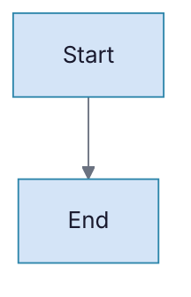
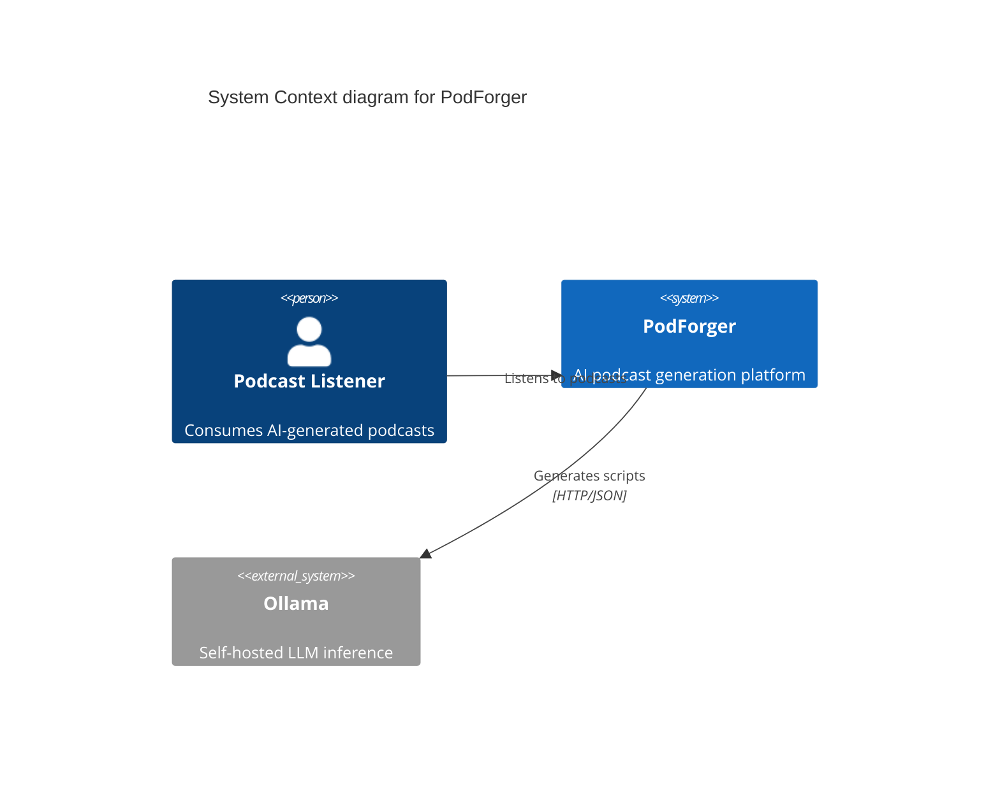

# Innovation Ways Diagram Generator

## Purpose

Generate technical diagrams in the appropriate diagram-as-code language, applying Innovation Ways brand styling, and render them to image files (SVG or PNG).

## Instructions

### 1. Select Diagram Language

Choose the language based on the diagram type:

| Diagram Type | Language | Rationale |
|-------------|----------|-----------|
| Flowcharts | **Mermaid** | Widest support, renders in GitHub |
| Sequence diagrams | **Mermaid** | Clean syntax, good auto-layout |
| Architecture overviews | **Mermaid** (flowchart with subgraphs) | Supports nested grouping |
| C4 Context/Container | **Mermaid** (C4 diagram type) | Native C4 support since Mermaid v10 |
| ER diagrams | **Mermaid** (erDiagram) | Good relationship notation |
| State machines | **Mermaid** (stateDiagram-v2) | Clean state representation |
| Gantt charts | **Mermaid** (gantt) | Built-in timeline support |
| Mind maps | **Mermaid** (mindmap) | Simple hierarchy |
| Class diagrams | **Mermaid** (classDiagram) | UML-compliant |
| Git graphs | **Mermaid** (gitGraph) | Branch visualization |
| Client-facing (high aesthetics) | **D2** | Superior auto-layout, modern look |
| Cloud architecture with icons | **Python Diagrams** (mingrammer) | Official cloud provider icons |
| Complex UML | **PlantUML** | Most comprehensive UML support |

**Default to Mermaid** unless there is a specific reason to use another language.

### 2. Apply Brand Theme

Every Mermaid diagram MUST include the IW theme initialization as the first line. Load it from `templates/brand/brand.json` field `diagrams.mermaidInit`:



For D2 diagrams, apply brand colors through D2's style system.

### 3. Diagram Complexity Guidelines

- **Maximum 15 nodes** per diagram. If more are needed, split into multiple diagrams at different abstraction levels.
- **Maximum 3 levels** of nesting (subgraphs within subgraphs).
- **Label every edge** with a concise description of the relationship.
- **Use meaningful node IDs** — `API[FastAPI Backend]` not `A[FastAPI Backend]`.
- **Group related components** using subgraphs with descriptive labels.
- **Consistent direction**: Use `TD` (top-down) for hierarchical diagrams, `LR` (left-right) for flow/sequence-like diagrams.

### 4. C4 Model Guidelines

When generating C4 architecture diagrams:

- **Level 1 — System Context**: Show the system as a single box, surrounded by users and external systems. Max 8-10 elements.
- **Level 2 — Container**: Show the major containers (applications, databases, message queues) within the system boundary. Max 10-12 elements.
- **Level 3 — Component**: Show components within a single container. Max 12-15 elements. Generate one diagram per container.
- **Level 4 — Code**: Rarely needed. Only generate if explicitly requested.

Use Mermaid's C4 diagram syntax:



### 5. Rendering

**Preferred method**: Use mermaid-cli (mmdc) for rendering:

```bash
mmdc -i diagram.mmd -o diagram.svg -b white
mmdc -i diagram.mmd -o diagram.png -b white -w 1200
```

**Fallback**: If mmdc is unavailable, use Kroki.io API:

```bash
curl -X POST https://kroki.io/mermaid/svg \
  -H "Content-Type: text/plain" \
  -d @diagram.mmd \
  -o diagram.svg
```

**MCP server**: If the Mermaid MCP server is configured, use it for rendering.

### 6. Output Format Selection

| Use Case | Format | Rationale |
|----------|--------|-----------|
| Embedding in HTML/PDF | **SVG** | Vector, scales perfectly, smallest file |
| Embedding in PowerPoint | **PNG** (width: 1200px+) | PPTX requires raster images |
| Standalone sharing | **SVG** or **PNG** | SVG preferred for quality |
| Print documents | **SVG** | Vector ensures print quality |

### 7. File Naming Convention

Save diagram source and rendered output with descriptive names:

```
diagrams/
├── system-context.mmd          # Mermaid source
├── system-context.svg          # Rendered SVG
├── container-diagram.mmd
├── container-diagram.svg
├── episode-generation-sequence.mmd
├── episode-generation-sequence.svg
└── ...
```

Use kebab-case. Name should describe the diagram content, not a generic label.

## Output Format

- Mermaid source file (`.mmd`) — always saved for future editing
- Rendered image (`.svg` preferred, `.png` when needed)
- Both files in the same directory

## Files Referenced

- `templates/brand/brand.json` — For `diagrams.mermaidInit` theme configuration
