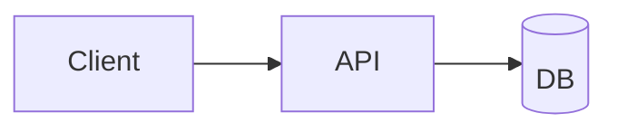
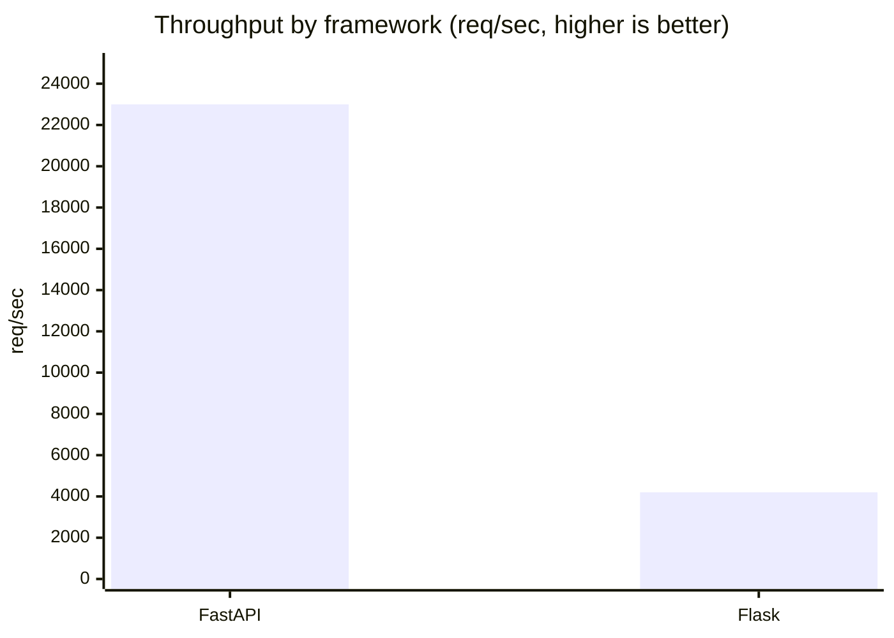

# Research Document Output Format

This file provides the canonical template for all research documents produced by `iw-research`.

---

## File Naming and Location

**Path**: `docs/research/{ID}-{slug}.md`

Where:
- `{ID}` is the reserved research ID from `iw next-id --type research` (e.g., `R-00001`)
- `{slug}` is a 3-5 word kebab-case descriptor of the topic (e.g., `redis-queue-comparison`)

**Example**: `docs/research/R-00001-redis-queue-comparison.md`

If the `docs/research/` directory does not exist, create it first:
```bash
mkdir -p docs/research/
```

---

## Document Template

Style: **hybrid analyst-led, rigor-backed** — lead with the answer, prove it
transparently, calibrate every claim. Grounding research:
[R-00158](../../docs/research/R-00158-research-report-writing-best-practices.md).

```markdown
# {Declarative Title — state the takeaway, not just the topic}

| Field | Value |
|-------|-------|
| **ID** | {ID} |
| **Date** | {YYYY-MM-DD} |
| **Mode** | {tech\|market\|deep\|general} |
| **Depth** | {quick\|standard\|deep} |
| **Status** | draft |

---

## Executive Summary

{BLUF — lead with the answer. 4-6 sentences a busy reader can act on WITHOUT reading
the body: the governing thought (primary answer), the 2-3 most important findings
(confidence-tagged), and the top recommendation. Write this LAST. ~5-10% of length.}

## Introduction

### Why this research
{The motivation/trigger — what prompted it, why it matters now. Do NOT state findings
or conclusions here ("found", "shows" are forbidden — this is framing).}

### Objectives
{The specific questions this research answers / what we expect to learn.}

### Scope
{What is in and out of scope. Boundaries are deliberate design choices (distinct from
Limitations, which are constraints outside your control).}

## Background & Context

{Domain context, key concepts/definitions, and prior/related work the reader needs to
understand the findings. Embed into the Introduction if only 2-3 sentences are needed.}

## Methodology
{Brief: primary vs secondary sources, how the research was done, and the confidence
scale: HIGH = multiple authoritative corroborating sources; MEDIUM = credible but
limited corroboration; LOW = single-source or inference. Optional for quick mode.}

## Findings

### F1 — {Declarative heading stating the finding} [HIGH]

> **Why:** {one-line framing if a figure follows — what it shows and why}

{Claim FIRST, then evidence. Inline citations: [source text](url). A finding is
*what was observed*. Add a visualization when the finding has a shape (see below).}

### F2 — {Declarative heading} [MEDIUM]

{Claim, evidence, inline citations. Note dissenting views / incomplete data.}

### F3 — {Declarative heading} [LOW]

{Be explicit about uncertainty: "based on [a single source](url); needs validation".}

## Analysis / Discussion

{Synthesize ACROSS findings — what they mean together, tensions between them,
comparison with prior work. May merge into Findings for short research.}

## Conclusion

{MANDATORY. First sentence restates the primary question as a DECLARATIVE ANSWER
("The evidence indicates that X…"). Synthesize — do not restate the findings list.
State the implications ("so what"). Introduce NO new evidence. No apologetic hedging.}

## Recommendations

1. **{Action}** — {To help with X, do Y, because Z. Trace to a finding/conclusion.} *(Supports F#)*
2. **{Action}** — {prioritized, specific, feasible.}
3. **{Action / what to avoid}** — {with the evidence that justifies it.}

## Limitations

- {Constraints OUTSIDE your control that qualify the findings — state confidently.}
- {Known gaps; what the evidence cannot support; what remains uncertain.}

## Sources

| # | Title | Credibility | URL |
|---|-------|-------------|-----|
| 1 | {title} | High | {url} |
| 2 | {title} | Medium | {url} |
| 3 | {title} | Low | {url} |
```

---

## Mandatory Elements Checklist

Every research document MUST contain (scale to depth — see Step 5):

- [ ] **Title + metadata** (declarative title; ID, Date, Mode, Depth, Status)
- [ ] **Executive Summary** — BLUF, standalone, written last (~5-10%)
- [ ] **Introduction** with explicit **Why this research**, **Objectives**, **Scope**
- [ ] **Background & Context** (domain context + prior work; embed in Intro if short)
- [ ] **Methodology** declaring the confidence scale (optional for quick mode)
- [ ] **Findings** — declarative headings, claim-first, `[HIGH/MEDIUM/LOW]` on each
- [ ] **Inline citations** on every factual claim: `[text](url)`
- [ ] **Analysis / Discussion** (may merge into Findings for short research)
- [ ] **Conclusion** — MANDATORY; answers the primary question, synthesizes, no new evidence
- [ ] **Recommendations** — each traceable to a finding/conclusion, prioritized
- [ ] **Limitations** (constraints outside your control — distinct from Scope)
- [ ] **Sources table** with #, title, credibility, URL for every source used
- [ ] **The firewall**: Findings vs Conclusions vs Recommendations kept distinct
- [ ] **Visualizations** for every finding with a shape — declarative title, framing blockquote before, interpretation after, source/units

---

## Writing Rules

### Citations
- **Every factual claim** must have an inline citation
- Citation format: `[claim or source text](url)`
- Prefer direct quotes for key statistics: `[Direct quote from source](url)`
- Do NOT cite a source you did not actually read

### Confidence Markers
Place `[HIGH/MEDIUM/LOW]` in the **section heading**, not just the body:

```markdown
### Redis delivers 100k+ ops/sec [HIGH confidence]
```

For LOW confidence findings, be explicit about uncertainty in the body:

```markdown
### Community considers X a pain point [LOW confidence]

This assessment is based on a single G2 review mentioning the issue;
broader community sentiment is unclear and requires additional research.
```

### Executive Summary
Write this **last** — after all findings are complete. BLUF: lead with the answer.
- First sentence states the governing thought (the primary answer), not the topic
- Then the 2-3 most important findings (confidence-tagged) and the top recommendation
- Must stand alone — a reader can act on it without reading the body
- ~5-10% of total length

### Introduction
The framing gateway — sets up the research, never reports results.
- **Why this research**: the motivation/trigger, why it matters now
- **Objectives**: the specific questions / what we expect to learn
- **Scope**: what is in and out (deliberate boundaries)
- NEVER use conclusion-register words here ("found", "shows", "demonstrates")

### Conclusion (MANDATORY — the most common gap)
- First sentence restates the primary question as a **declarative answer**
- **Synthesize**, don't restate — say what the findings mean *together* ("so what")
- Connect back to the Objectives; state implications for the reader's decision
- Introduce **no new evidence or sources**; no "In conclusion…"; no apologetic hedging
- A conclusion that merely lists the findings again has failed

### Recommendations
- Each follows: *"To help with X, we recommend Y, because Z"* — traceable to a finding
- **Prioritized** (by impact/urgency, not discovery order) and specific enough to act on
- Distinguish insight (belongs in the Conclusion) from action (belongs here)
- May include "what to avoid" and future-research recommendations

### Limitations
Be honest. Research has boundaries. Common limitations to include:
- Time-bounded: "Data as of {date}; market may have shifted"
- Scope: "This research covers X but does not address Y"
- Source quality: "Primary data unavailable; relied on secondary sources"
- Depth: "Not a comprehensive audit; further investigation recommended"

---

## Visualizations

A research document must not be text-only. Diagrams render natively in the IW AI
Core dashboard and PDF: fenced ` ```mermaid ` and ` ```d2 ` blocks are converted to
SVG with the Innovation Ways brand theme applied automatically — write the DSL, the
pipeline handles rendering and styling. Guidance below is editorial (R-00153);
for the diagram-tool landscape and aesthetics see R-00051.

### When to add a figure (vs. a table or text)

| The finding is about… | Use |
|-----------------------|-----|
| A single number, or a one/two-item comparison | **Bold inline text** |
| A handful of exact values in **one** unit | **Markdown table** |
| A trend, flow, hierarchy, relationship, distribution, or positioning | **A figure** |
| Exact values **and** their shape both matter | **Table + figure** |

Restraint matters: each figure must earn its place. Budget roughly **one orienting
figure** (concept map / problem structure) plus **one figure per shaped finding** —
never a figure per section by rote. No chartjunk, no 3D, no dual-axis.

### Choosing the chart by data relationship (FT Visual Vocabulary)

| Relationship | Go-to figure | Cautions |
|--------------|--------------|----------|
| Comparison / magnitude | Bar / column | ≤ ~15 categories; else rank + filter |
| Change over time / trend | Line / area | ordered (time) x-axis only |
| Part-to-whole | Stacked bar / treemap | pie only for 2-3 slices |
| Relationship / correlation | Scatter / bubble | add trend line for clarity |
| Distribution | Histogram / boxplot | 10-20 bins to start |
| Ranking | Ordered bar / lollipop | sort by value, not label |
| Flow / process | Flowchart / Sankey | label edges with volume/condition |
| Positioning of options | 2×2 quadrant matrix | shortlisting device, not a verdict |

### Figure craft (every figure)

1. **Declarative title = the takeaway.** "Async cuts p99 latency 5×", not "Latency by mode".
2. **Frame before, interpret after.** A one-line `>` blockquote stating *why this figure*
   precedes it; the prose after says what to take from it. Never drop a mute diagram.
3. **Caption carries units and source.** State the unit ("ops/sec") and cite external data.
4. **Accessibility.** Never encode by color alone — add labels, shapes, or line styles;
   ensure readable contrast; give every figure a one-sentence takeaway that doubles as alt text.

### Syntax examples

Structural diagram (Mermaid — renders client-side and in PDF):

````markdown
> **Why:** the request path crosses three services, which prose enumerates poorly.



*Figure 1. Request path: the API mediates every client-to-database call (source: this analysis).*
````

Quantitative chart (Mermaid `xychart-beta` for bar/line; use a table for other types):

````markdown

````

D2 (always server-rendered — no client runtime, so it works in every view):

````markdown
```d2
client -> api -> db
```
````

---

## Example Finding (properly cited)

```markdown
### FastAPI outperforms Flask on async endpoints [HIGH confidence]

FastAPI handles 23,000 requests/second versus Flask's 4,200 on identical
async endpoint workloads, a 5.4x performance advantage [TechEmpower
Framework Benchmarks Round 21](https://www.techempower.com/benchmarks/
preamble/r21/). This gap widens under concurrent load, with FastAPI
maintaining sub-10ms latency at 1,000 concurrent connections while
Flask degrades to 45ms [async-benchmark-blog.netlify.app].
```
