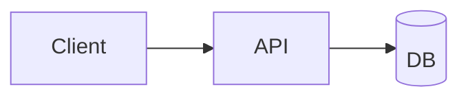
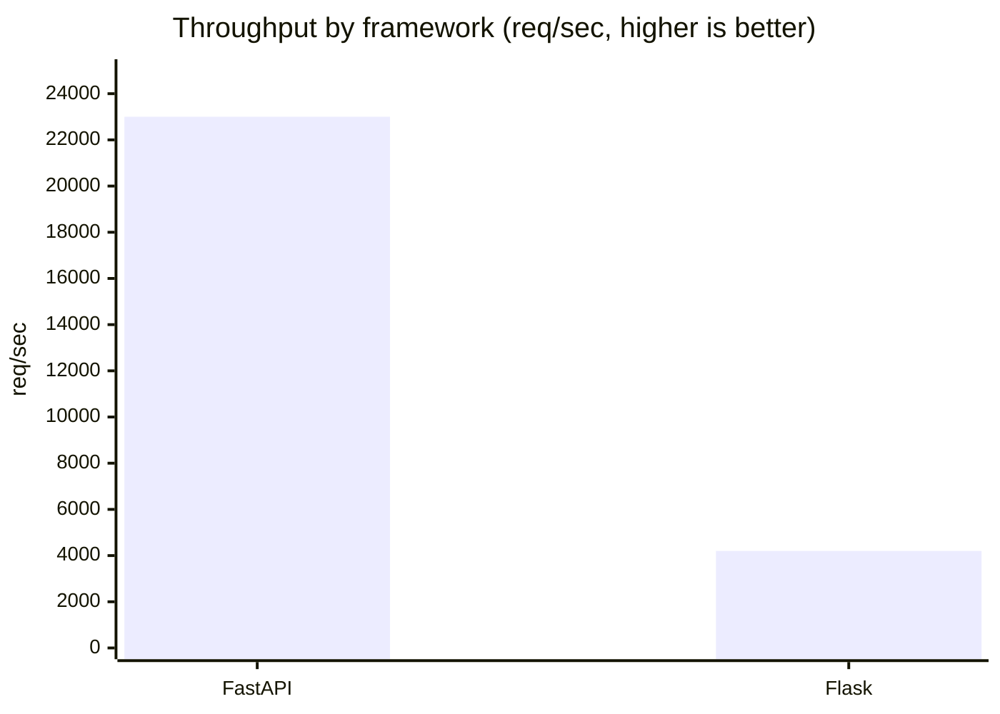

# Research Document Output Format

This file provides the canonical template for all research documents produced by `iw-research`.

---

## File Naming and Location

**Path**: `docs/research/{ID}-{slug}.md`

Where:
- `{ID}` is the reserved research ID from `iw next-id --type research` (e.g., `R-00001`)
- `{slug}` is a 3-5 word kebab-case descriptor of the topic (e.g., `redis-queue-comparison`)

**Example**: `docs/research/R-00001-redis-queue-comparison.md`

If the `docs/research/` directory does not exist, create it first:
```bash
mkdir -p docs/research/
```

---

## Document Template

```markdown
# {Title}

**Research ID**: {ID}
**Date**: {YYYY-MM-DD}
**Mode**: {tech|market|deep|general}
**Depth**: {quick|standard|deep}
**Primary Question**: {main research question}

---

## Executive Summary

{3-5 sentences covering: the topic, key findings, and primary recommendation.
This section should stand alone as a summary for busy readers.}

## Background

{2-3 sentences on why this research was conducted and what prompted it.
Include any relevant context about the project or decision driving this research.}

## Findings

### {Finding Title} [HIGH confidence]

{Finding text with inline citations: [source text](url)}

{Further explanation or evidence supporting this finding.}

### {Finding Title} [MEDIUM confidence]

{Finding text with inline citations: [source text](url)}

{Further explanation or caveats. Note any dissenting views or incomplete data.}

### {Finding Title} [LOW confidence]

{Finding text — when confidence is low, be explicit about uncertainty:
"This finding is based on [single source](url) and requires additional validation."}

---

## Recommendations

1. **Primary**: {main recommendation with rationale. Reference specific findings that support this.}

2. **Alternative**: {alternative approach if primary recommendation is not viable.
Include the scenario where this alternative is preferred.}

3. **Avoid**: {what NOT to do and the specific evidence that shows why this path is problematic.}

---

## Limitations

- {What this research does not cover}
- {Known gaps in the research — be honest}
- {Time constraints or source availability issues, if any}
- {Questions that remain unanswered}

---

## Sources

| # | Source | Credibility | URL |
|---|--------|-------------|-----|
| 1 | {title} | HIGH | {url} |
| 2 | {title} | MEDIUM | {url} |
| 3 | {title} | LOW | {url} |

---

## Appendix: Research Log

**Date range**: {start} to {end}
**Queries run**: {N} WebSearch, {N} WebFetch, {N} context7
**Mode used**: {mode}
**Depth level**: {depth}

{Optional: brief notes on research process, challenges encountered, or notable deviations from standard process.}
```

---

## Mandatory Elements Checklist

Every research document MUST contain:

- [ ] **Frontmatter line** with Research ID, Date, Mode, Depth, Primary Question
- [ ] **Executive Summary** (3-5 sentences; must stand alone)
- [ ] **Background** (2-3 sentences on why research was conducted)
- [ ] **Findings sections** with `[HIGH/MEDIUM/LOW]` in each heading
- [ ] **Inline citations** on every factual claim: `[text](url)`
- [ ] **Recommendations section** with Primary, Alternative, Avoid
- [ ] **Limitations section** (be honest — don't pretend coverage is complete)
- [ ] **Sources table** with #, title, credibility, URL for every source used
- [ ] **Confidence markers** in ALL finding section headers
- [ ] **Visualizations** for every finding with a shape (see "Visualizations" below) — each with a declarative title, a framing blockquote before, interpretation after, and source/units

---

## Writing Rules

### Citations
- **Every factual claim** must have an inline citation
- Citation format: `[claim or source text](url)`
- Prefer direct quotes for key statistics: `[Direct quote from source](url)`
- Do NOT cite a source you did not actually read

### Confidence Markers
Place `[HIGH/MEDIUM/LOW]` in the **section heading**, not just the body:

```markdown
### Redis delivers 100k+ ops/sec [HIGH confidence]
```

For LOW confidence findings, be explicit about uncertainty in the body:

```markdown
### Community considers X a pain point [LOW confidence]

This assessment is based on a single G2 review mentioning the issue;
broader community sentiment is unclear and requires additional research.
```

### Executive Summary
Write this **last** — after all findings are complete. It should:
- State the topic clearly in the first sentence
- Present the key finding or recommendation
- End with a clear takeaway or actionable next step
- Be 3-5 sentences (never exceed 100 words)

### Recommendations
- **Primary**: The recommended action with specific rationale tied to findings
- **Alternative**: What to do if Primary isn't viable (cost, timeline, technical constraints)
- **Avoid**: Specific things NOT to do, with evidence explaining why

### Limitations
Be honest. Research has boundaries. Common limitations to include:
- Time-bounded: "Data as of {date}; market may have shifted"
- Scope: "This research covers X but does not address Y"
- Source quality: "Primary data unavailable; relied on secondary sources"
- Depth: "Not a comprehensive audit; further investigation recommended"

---

## Visualizations

A research document must not be text-only. Diagrams render natively in the IW AI
Core dashboard and PDF: fenced ` ```mermaid ` and ` ```d2 ` blocks are converted to
SVG with the Innovation Ways brand theme applied automatically — write the DSL, the
pipeline handles rendering and styling. Guidance below is editorial (R-00153);
for the diagram-tool landscape and aesthetics see R-00051.

### When to add a figure (vs. a table or text)

| The finding is about… | Use |
|-----------------------|-----|
| A single number, or a one/two-item comparison | **Bold inline text** |
| A handful of exact values in **one** unit | **Markdown table** |
| A trend, flow, hierarchy, relationship, distribution, or positioning | **A figure** |
| Exact values **and** their shape both matter | **Table + figure** |

Restraint matters: each figure must earn its place. Budget roughly **one orienting
figure** (concept map / problem structure) plus **one figure per shaped finding** —
never a figure per section by rote. No chartjunk, no 3D, no dual-axis.

### Choosing the chart by data relationship (FT Visual Vocabulary)

| Relationship | Go-to figure | Cautions |
|--------------|--------------|----------|
| Comparison / magnitude | Bar / column | ≤ ~15 categories; else rank + filter |
| Change over time / trend | Line / area | ordered (time) x-axis only |
| Part-to-whole | Stacked bar / treemap | pie only for 2-3 slices |
| Relationship / correlation | Scatter / bubble | add trend line for clarity |
| Distribution | Histogram / boxplot | 10-20 bins to start |
| Ranking | Ordered bar / lollipop | sort by value, not label |
| Flow / process | Flowchart / Sankey | label edges with volume/condition |
| Positioning of options | 2×2 quadrant matrix | shortlisting device, not a verdict |

### Figure craft (every figure)

1. **Declarative title = the takeaway.** "Async cuts p99 latency 5×", not "Latency by mode".
2. **Frame before, interpret after.** A one-line `>` blockquote stating *why this figure*
   precedes it; the prose after says what to take from it. Never drop a mute diagram.
3. **Caption carries units and source.** State the unit ("ops/sec") and cite external data.
4. **Accessibility.** Never encode by color alone — add labels, shapes, or line styles;
   ensure readable contrast; give every figure a one-sentence takeaway that doubles as alt text.

### Syntax examples

Structural diagram (Mermaid — renders client-side and in PDF):

````markdown
> **Why:** the request path crosses three services, which prose enumerates poorly.



*Figure 1. Request path: the API mediates every client-to-database call (source: this analysis).*
````

Quantitative chart (Mermaid `xychart-beta` for bar/line; use a table for other types):

````markdown

````

D2 (always server-rendered — no client runtime, so it works in every view):

````markdown
```d2
client -> api -> db
```
````

---

## Example Finding (properly cited)

```markdown
### FastAPI outperforms Flask on async endpoints [HIGH confidence]

FastAPI handles 23,000 requests/second versus Flask's 4,200 on identical
async endpoint workloads, a 5.4x performance advantage [TechEmpower
Framework Benchmarks Round 21](https://www.techempower.com/benchmarks/
preamble/r21/). This gap widens under concurrent load, with FastAPI
maintaining sub-10ms latency at 1,000 concurrent connections while
Flask degrades to 45ms [async-benchmark-blog.netlify.app].
```
