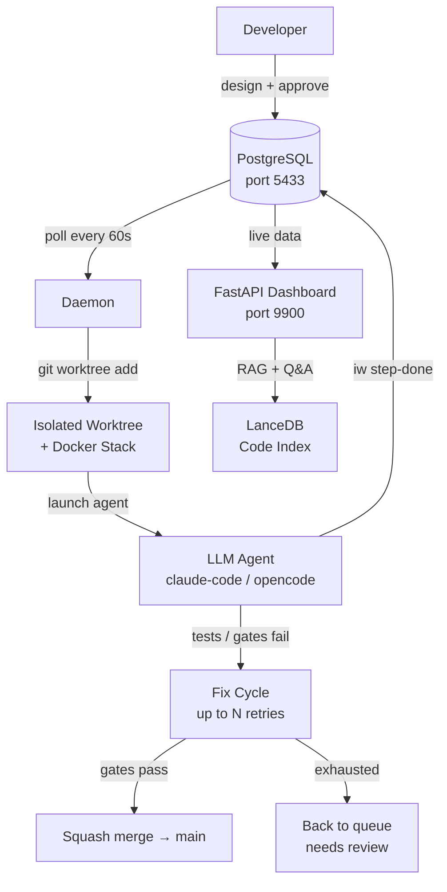

# IW AI Core

**An AI-assisted development platform that schedules LLM agents in isolated git worktrees, runs automated fix cycles, and squash-merges to main — so developers review outcomes, not process.**

[](LICENSE)
[](https://securityscorecards.dev/viewer/?uri=github.com/innovation-ways/iw-ai-core)
[](https://www.python.org/downloads/)


---

IW AI Core is the orchestration layer between your backlog and your main branch. You design a feature or bug fix, approve it, and the platform handles the rest: it picks up work items, spins up a sandboxed git worktree with its own Docker stack, launches a claude-code or opencode agent, runs your test and quality gates, iterates through fix cycles, and squash-merges on success. A FastAPI dashboard gives you live visibility into every agent, job, and document the system produces.

**Who it's for**: engineering teams that want AI-assisted development without sacrificing code review standards or losing traceability.

---

## Table of Contents

- [Quick Start](#quick-start)
- [Features](#features)
- [Architecture](#architecture)
- [Why IW AI Core?](#why-iw-ai-core)
- [Dashboard](#dashboard)
- [Documentation](#documentation)
- [Contributing](#contributing)
- [License](#license)

---

## Quick Start

**Prerequisites**: Docker, Python 3.11+, [uv](https://docs.astral.sh/uv/)

```bash
git clone https://github.com/innovation-ways/iw-ai-core.git
cd iw-ai-core
./ai-core.sh install      # sync deps, start DB, run migrations
./ai-core.sh start        # start daemon + dashboard
```

Open **http://localhost:9900** — the dashboard is live.

> For manual setup, cloud deployments, or non-Docker environments see [DB Setup](docs/IW_AI_Core_DB_Setup.md).

---

## Features

| Feature | Description |
|---------|-------------|
| Agent Scheduler | Polls approved work items, launches claude-code or opencode agents in isolated git worktrees |
| Worktree Isolation | Each work item gets a fresh git worktree with its own Docker compose stack and PostgreSQL |
| Automated Fix Cycles | Agents retry failing test/quality gates up to N times before escalating for review |
| Web Dashboard | FastAPI + htmx UI: queue, history, batches, docs, code understanding, jobs, worktrees |
| Code Understanding | LanceDB-backed RAG with streaming Q&A, symbol explainer, and citation links |
| Doc Generation | AI-generated versioned docs with diff tracking, HTML/PDF export, and stale detection |
| Test & Quality Runner | Launch and monitor pytest suites and lint gates from the UI with live output |
| Multi-Project | Manage multiple repositories from one platform via `projects.toml` |
| DB Backups | Daily scheduled logical backups with configurable retention and a guided restore runbook |
| `iw` CLI | Agent-to-DB bridge: `iw step-done`, `iw next-id`, `iw register`, and more |

---

## Architecture



All operational state lives in PostgreSQL — no files, no race conditions. The daemon also drives background jobs for doc generation (`DocGenerationJob`) and code indexing (`CodeIndexJob`).

---

## Why IW AI Core?

Modern AI coding tools answer questions or write patches — they don't own the full development lifecycle. IW AI Core is built around the insight that **the hard part isn't generating code, it's integrating it**: running the right tests, iterating on failures, respecting branch policies, and producing a reviewable diff.

|  | IW AI Core | LangChain | AutoGen | Temporal |
|--|:--:|:--:|:--:|:--:|
| LLM agent scheduling on backlog items | ✅ | ❌ | ❌ | ❌ |
| Git worktree isolation per work item | ✅ | ❌ | ❌ | ❌ |
| Automated test/gate fix cycles | ✅ | ❌ | Partial | ❌ |
| Web dashboard with live agent visibility | ✅ | ❌ | Partial | ✅ |
| RAG-backed code understanding | ✅ | Partial | ❌ | ❌ |
| Multi-project management | ✅ | ❌ | ❌ | Partial |
| Versioned AI-generated documentation | ✅ | ❌ | ❌ | ❌ |

---

## Dashboard


The dashboard is the human interface to the platform. Key pages:

- **Queue / History / Batches** — design work items, approve batches, track outcomes
- **Code** — RAG module browser, symbol explainer, streaming Q&A with citations
- **Docs** — per-project doc catalogue with version diffs and HTML/PDF export
- **Jobs** — unified table of all background jobs (batches, indexing, doc generation)
- **Worktrees** — live git status of every active agent worktree


---

## Documentation

| Document | Contents |
|----------|----------|
| [Architecture](docs/IW_AI_Core_Architecture.md) | System layout and end-to-end flow |
| [DB Setup](docs/IW_AI_Core_DB_Setup.md) | Production and bootstrap setup |
| [CLI Spec](docs/IW_AI_Core_CLI_Spec.md) | Every `iw` command: inputs, outputs, DB ops |
| [Daemon Design](docs/IW_AI_Core_Daemon_Design.md) | Daemon loop, state transitions, monitoring |
| [Dashboard Design](docs/IW_AI_Core_Dashboard_Design.md) | Dashboard pages, htmx patterns, SSE |
| [Testing Strategy](docs/IW_AI_Core_Testing_Strategy.md) | Test layers, infrastructure, conventions |
| [DB Backup & Restore](docs/IW_AI_Core_DB_Backup_Restore.md) | Backup configuration and restore runbook |
| [Worktree Isolation](docs/IW_AI_Core_Worktree_Isolation.md) | Per-worktree Docker compose design |

---

## Contributing

Contributions are welcome. See [CONTRIBUTING.md](CONTRIBUTING.md) for how to open issues and pull requests.

All commits must be signed-off per the [Developer Certificate of Origin](https://developercertificate.org/):

```bash
git commit -s -m "your message"
```

Please do not file public issues for security vulnerabilities — see [SECURITY.md](SECURITY.md) for the responsible disclosure process.

This project follows the [Contributor Covenant v3](CODE_OF_CONDUCT.md). Report conduct concerns to info@innovation-ways.com.

---

## License

Licensed under the [Apache-2.0](LICENSE) license.  
Copyright © 2026 Innovation Ways.

"Innovation Ways" is a trademark of Innovation Ways. See [TRADEMARK.md](TRADEMARK.md) for permitted uses.

---

Maintained by [Innovation Ways](https://innovation-ways.com).
