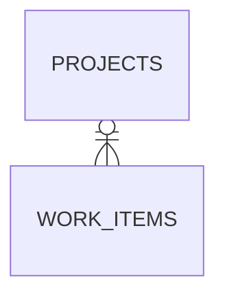

# I-00081_S05_tests-impl_prompt

**Work Item**: I-00081 — Code page "Architecture Diagram" widget shows "Syntax error in text — mermaid version 11.14.0"
**Step**: S05
**Agent**: tests-impl

---

## ⛔ Docker is off-limits

You MUST NOT execute any command that changes Docker container/volume/network state.
Allowed: testcontainers via pytest fixtures; read-only `docker ps|inspect|logs`; `./ai-core.sh` / `make` targets.
Full policy: `docs/IW_AI_Core_Agent_Constraints.md`.

## ⛔ Migrations: agents generate, daemon applies

This step adds no migrations and touches no database schema.

## Input Files

- **Runtime step state** — prefer `uv run iw item-status I-00081 --json`.
- `ai-dev/active/I-00081/I-00081_Issue_Design.md` — design document (read **Test to Reproduce**, **Acceptance Criteria**, **TDD Approach** in full).
- `ai-dev/active/I-00081/reports/I-00081_S01_backend-impl_report.md` and `..._S03_frontend-impl_report.md` — **read both first**: pull the exact new context-var name(s) and the exact rendered-output markers (does the Markdown-doc form produce `<pre data-lang="mermaid">` blocks? does the bare-DSL form still produce `<div class="mermaid">`? did S01 keep two vars or fold them?). Assert against what was actually implemented, not against this prompt's guesses.
- `tests/dashboard/test_code_page_arch_diagram.py` — the **existing** I-00055 test file. **Copy its fixture pattern**: the local `client` fixture (overrides `get_db`, pops `IW_CORE_EXPECTED_INSTANCE_ID`), `_seed_docs` (seeds an `architecture-map` `ProjectDoc` + a `diagram-architecture` `ProjectDoc`), `_seed_completed_job` (seeds a completed `CodeIndexJob` with `doc_id=f"{pid}:architecture-map"`), then `client.get(f"/project/{pid}/code")`. Do NOT modify that file — it covers the legacy bare-DSL path and must stay green.
- `tests/dashboard/conftest.py` — the `client` fixture and DB fixtures. Tests that drive a FastAPI route via the `client` fixture **MUST** live under `tests/dashboard/` (the `client` fixture is registered only there — a test in `tests/unit/` or `tests/integration/` fails with `fixture 'client' not found`, see I-00067 and `tests/CLAUDE.md`).
- `tests/CLAUDE.md` — test rules (testcontainers only, never the live DB; `monkeypatch.delenv` not `importlib.reload`; assertion-scoping for CSS class names). **It now requires reading `skills/iw-ai-core-testing/SKILL.md` before writing tests** — read that skill: assertion-strength / "would this fail if the production line were deleted?" rule, the live-DB-guard rules, cross-project isolation, the test red-flag checklist. Apply it.
- `dashboard/routers/code_ui.py` (post-S01), `dashboard/templates/fragments/code_architecture_diagram.html` / `code_architecture_view.html` (post-S03), `orch/db/models.py` (`DocType`, `ProjectDoc`, `CodeIndexJob`, `EditorialCategory`) — what you're testing.

## Output Files

- `ai-dev/active/I-00081/reports/I-00081_S05_tests-impl_report.md` — step report.
- New (expected): `tests/dashboard/test_i00081_code_page_arch_diagram.py`.

## Context

I-00081 makes the Code page handle a `diagram-architecture` ProjectDoc that is a **Markdown document with fenced ```mermaid blocks** (the `iw-doc-generator` form: `# H1` + `<!-- … -->` comments + `> **Why this diagram?**` blockquotes + N ` ```mermaid ` fences, each with `---\nconfig:\n  layout: elk\n---`). Pre-fix the page handed that whole blob to a `class="mermaid"` element → "Syntax error in text / mermaid version 11.14.0". Post-fix the page strips the comments / leading H1 / per-block ELK front-matter and renders the Markdown so each fence becomes a client-renderable `<pre data-lang="mermaid">` block. The legacy bare-DSL form (`<!-- purpose: … -->\n<bare DSL>`) is unchanged — still rendered via `<div class="mermaid">` with the purpose line above it. Your job: a regression test file that **fails against pre-fix code and passes after**, plus tests covering the root-cause paths and edge cases.

### CRITICAL: Semantic Correctness Over Shape Checking (I003 Lesson)

I002's tests checked API response SHAPE (key exists, is a list, is non-empty) and passed. But the bug was NOT fixed. Tests must verify SPECIFIC VALUES:

- BAD: `assert "permissions" in data` (shape only)
- GOOD: `assert "brands:manage" in permissions` (semantic — verifies specific expected value)
- GOOD: `assert "*" not in permissions` (semantic — verifies unwanted value is absent)

Concretely for I-00081:
- BAD: `assert "mermaid" in html` — false-positives on the `<script src=".../mermaid.min.js">` include and on `language-mermaid`. GOOD: `assert 'class="mermaid"' in html` or `re.search(r'class\s*=\s*"[^"]*\bmermaid\b[^"]*"', html)` — scoped to an actual element.
- BAD: `assert "<pre" in html` — there are other `<pre>`s on the page. GOOD: `assert html.count('<pre data-lang="mermaid">') >= 2` for a 2-fence seed doc — assert the **count of renderable diagram blocks**.
- BAD: `assert "Syntax error" not in html` alone — the error text is injected client-side by Mermaid, not present in the server HTML; the *server-side* symptom is the raw Markdown landing inside a `class="mermaid"` element. GOOD: assert the **absence of the bug marker** — e.g. the doc's literal ` ```mermaid ` fence string does NOT appear inside any `class="mermaid"` element, and the doc's `# …` H1 text does NOT appear as plain text inside `#code-arch-diagram` as a `<h1>`/heading; AND assert the **presence of the fix marker** — `<pre data-lang="mermaid">` blocks with the diagram bodies.
- For the ELK front-matter: assert `"layout: elk" not in html` (or at minimum that no `pre[data-lang="mermaid"]` block body contains `layout: elk`) — locks in the strip that keeps client-side Mermaid from throwing.
- For the bare-DSL regression test: assert exactly one `<div class="mermaid">` and that its text contains the DSL body (`graph TD`), plus the `<!-- purpose: -->` value rendered as the purpose line — not just "a `<div>` exists".

## Requirements

Create `tests/dashboard/test_i00081_code_page_arch_diagram.py` with at least these tests (semantic assertions, isolated, deterministic — copy the `client` / `_seed_*` helper pattern from `tests/dashboard/test_code_page_arch_diagram.py`; for the `architecture-map` doc you can reuse a minimal markdown body and a completed `CodeIndexJob` so the Code page enters the "has a completed job" branch):

### 1. `test_i00081_markdown_format_diagram_doc_renders_diagrams_not_raw_markdown` (the reproduction test)
Seed a `diagram-architecture` `ProjectDoc` whose `content` is the `iw-doc-generator` Markdown form, e.g.:
```
# Demo Project — Architecture Diagram

<!-- generated: 2026-05-11 -->
<!-- doc_job: deadbeef-0000-0000-0000-000000000000 -->

> **Why this diagram?** Physical topology.

```mermaid
---
config:
  layout: elk
---
flowchart TB
    DB[(("PostgreSQL"))]
    DB --> App["App"]
```

---

> **Why this diagram?** Data model.


```
`GET /project/{pid}/code`. Assert (semantic):
- status 200;
- `html.count('<pre data-lang="mermaid">') >= 2` (both fenced blocks became client-renderable diagram blocks);
- `"flowchart TB" in html` **and** `"erDiagram" in html` (the diagram bodies survived);
- the raw Markdown did **not** leak into a Mermaid container: the literal triple-backtick `mermaid` fence string does NOT appear inside any `class="mermaid"` element, and `"# Demo Project — Architecture Diagram"` does NOT appear as the text of a heading/element inside the `#code-arch-diagram` region (a robust signal: `'<div class="mermaid"># ' not in html`, and no `<h1>` whose text equals the doc's H1 inside the diagram widget — pick the assertion that's robust against unrelated `<h1>`s elsewhere on the page);
- `"layout: elk" not in html` (the ELK front-matter was stripped before client render) — or at minimum it does not appear inside any `pre[data-lang="mermaid"]` block.

**This test must fail against pre-fix `code_ui.py`** (pre-fix: the whole Markdown blob is `_clean_diagram_dsl`'d and put into `<div class="mermaid">`, so `'<pre data-lang="mermaid">'` count from the diagram doc is 0 and `'<div class="mermaid">'` contains `# Demo Project …` and the literal fences). Confirm that by reading S01's report (it documents the pre/post behaviour); do **not** revert source at runtime to prove RED.

### 2. `test_i00081_bare_dsl_format_still_renders_single_mermaid_div` (regression — legacy path)
Seed a `diagram-architecture` `ProjectDoc` whose `content` is the `orch/rag/mapgen.py` form: `"<!-- purpose: shows overall architecture -->\n---\nconfig:\n  layout: elk\n---\ngraph TD\n  A[CLI] --> B[Daemon]\n  B --> C[DB]\n"`. `GET /project/{pid}/code`. Assert: 200; exactly one `<div class="mermaid">` (`html.count('<div class="mermaid">') == 1`); its text contains `graph TD` and `A[CLI]`; the page shows `shows overall architecture` as the purpose line; no `<pre data-lang="mermaid">` *from the diagram doc* (count from the diagram doc is 0 — note: if the seeded `architecture-map` content also has an inline ```mermaid block it could add a `<pre data-lang="mermaid">`; keep the arch-map content free of mermaid fences in this test so the count is unambiguous); `"<!-- purpose:" not in html` and `"---" `-config front-matter not present in the rendered DSL (the leading `---\n…\n---` is stripped by `_clean_diagram_dsl`). This must pass both pre- and post-fix (the legacy path is unchanged) — it's a guard that the fix didn't break it.

### 3. `test_i00081_markdown_doc_leading_h1_not_duplicated` (edge case)
Same Markdown-format seed as test 1. Assert the rendered widget doesn't show two "Architecture Diagram" titles: the fragment's own `<h3>Architecture Diagram</h3>` is present, and the doc's leading `# Demo Project — Architecture Diagram` H1 does **not** appear as an `<h1>` inside the `#code-arch-diagram` region (the H1 was dropped by S01). Use a robust assertion (e.g. extract the `#code-arch-diagram` block and assert `"<h1" not in that_block`, or assert the H1's exact text isn't rendered as a heading there).

### 4. `test_i00081_api_code_architecture_endpoint_handles_markdown_doc` (the htmx fragment route)
Same Markdown-format seed. `GET /project/{pid}/api/code/architecture` (the `code_architecture()` route — it renders `fragments/code_architecture_view.html` directly and shares the same helper). Assert 200 and the same "diagrams render, no raw-Markdown leak" properties as test 1 (at least: `html.count('<pre data-lang="mermaid">') >= 2`, `"flowchart TB" in html`, the literal fence string not inside a `class="mermaid"` element). This route requires an `architecture-map` doc to exist (else it returns the empty-state fragment) — seed one.

### 5. (Optional, if S01 introduced a pure helper) `test_i00081_render_arch_diagram_helper_detects_format`
If S01 added a pure function like `_render_arch_diagram` in `code_ui.py` that is importable without a DB session in its chain, add a direct unit-ish test (still under `tests/dashboard/` if importing `dashboard.routers.code_ui` triggers `SessionLocal` — see the `tests/CLAUDE.md` gotcha; if it does, keep it in this dashboard test file with the `client`/`db_session` fixture in scope so the import is safe). Call it with the Markdown form → assert the returned HTML has `<pre data-lang="mermaid">` and no `layout: elk`; call it with the bare-DSL form → assert it returns the bare DSL / None per S01's contract. Skip this test cleanly if S01 didn't expose such a helper (read S01's report).

## Test Verification (NON-NEGOTIABLE — targeted only)

Run **only** the file you created:
```bash
uv run pytest tests/dashboard/test_i00081_code_page_arch_diagram.py -v
```
Also run the existing file to confirm you didn't break it (you must not have touched it, but verify): `uv run pytest tests/dashboard/test_code_page_arch_diagram.py -v`.
Do **NOT** run `make test-integration` or `make test-unit` — those are S11/S12 QV gates with their own (longer) budgets; running them here blows this step's budget (I-00073/S03 post-mortem). Do **NOT** revert source files at runtime to "prove RED" — the design author and S01's report establish the pre-fix behaviour; your job is GREEN-against-fixed-code + good coverage. Run `make lint` on your new file.

Do not report `tests_passed: true` unless your targeted tests pass with zero failures. If a test fails because an implementation step left something incomplete, report `blocked` with the specific gap — do **not** weaken assertions to make them pass.

## Pre-flight Quality Gates

1. `make format`  2. `make typecheck`  3. `make lint` — fix anything they report on your new file; record in `preflight`.

## Subagent Result Contract

```json
{
  "step": "S05",
  "agent": "tests-impl",
  "work_item": "I-00081",
  "completion_status": "complete|partial|blocked",
  "files_changed": ["tests/dashboard/test_i00081_code_page_arch_diagram.py"],
  "preflight": {"format": "ok|fixed|skipped:<reason>", "typecheck": "ok|skipped:<reason>", "lint": "ok|skipped:<reason>"},
  "tests_passed": true,
  "test_summary": "X passed, 0 failed (Y skipped)",
  "blockers": [],
  "notes": "Which exact rendered-output markers you asserted against (cite S01/S03 reports); whether S01 exposed a pure helper (test 5 included or skipped); confirmation the existing test_code_page_arch_diagram.py still passes untouched."
}
```
