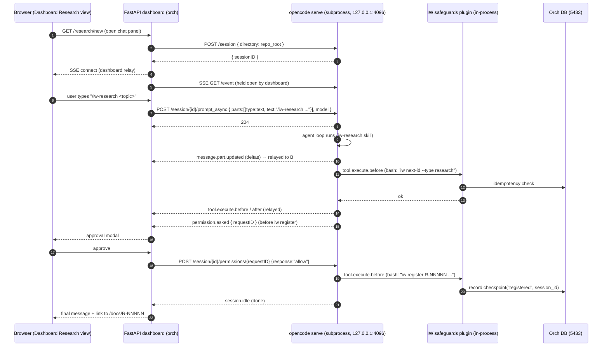
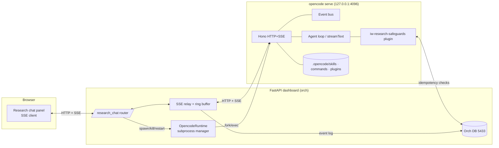

# R-00071 — Embedding OpenCode (sst/opencode) Behind the IW AI Core Dashboard

| Field | Value |
|-------|-------|
| ID | R-00071 |
| Date | 2026-05-14 |
| Mode | deep |
| Editorial category | technical |
| Status | draft |

**Primary question** — Can we embed `sst/opencode` behind the IW AI Core FastAPI dashboard to drive `/iw-research` end-to-end from the browser (single-user, single-session, *full execution* with safeguards, not Claude-locked), and what is the simplest viable architecture?

---

## Executive Summary

**OpenCode is the most embedding-friendly of the three candidates we are evaluating.** It ships with `opencode serve` — a headless HTTP server built on Bun + Hono that publishes an [OpenAPI 3.1 spec at `/doc`](https://opencode.ai/docs/server/), a Server-Sent-Events bus at `/event`, a complete REST surface for sessions/messages/permissions/files, and an [official type-safe `@opencode-ai/sdk`](https://opencode.ai/docs/sdk/) auto-generated from that spec via Stainless. There is no PTY scraping required and no Claude lock-in: [75+ providers are supported](https://opencode.ai/docs/providers/) (Anthropic, OpenAI, Google Vertex, Azure, Bedrock, OpenRouter, Ollama, LM Studio, OpenAI-compatible custom, OpenCode Zen, Vercel/Cloudflare gateways, etc.), with the model selected per session in the message body.

The **existing IW AI Core skill format works as-is**: OpenCode explicitly supports Claude-compatible skill discovery from `.claude/skills/<name>/SKILL.md` *in addition* to `.opencode/skills/<name>/SKILL.md`, walks up to the git worktree to find them, and exposes them through a single unified `skill` tool ([Skills docs](https://opencode.ai/docs/skills/)). Slash commands (`.opencode/commands/*.md`) and MCP servers (`mcp` block in `opencode.json`) round out the extension surface, and an in-process **plugin system** with `tool.execute.before` / `tool.execute.after` / `permission.asked` hooks gives us a place to enforce safeguards on side-effecting calls (`iw next-id`, `iw register`, `iw doc-update`) without modifying the agent loop.

Embedding has been done in production-ish form by at least seven independent open-source projects ([opencode-vibe](https://github.com/joelhooks/opencode-vibe), [opencode-web by chris-tse](https://github.com/chris-tse/opencode-web), [bjesus/opencode-web](https://github.com/bjesus/opencode-web), [pk-opencode-webui](https://github.com/prokube/pk-opencode-webui), [opencode-manager](https://github.com/chriswritescode-dev/opencode-manager), [opencode-webui](https://github.com/threehymns/opencode-webui), [hosenur/portal](https://github.com/hosenur/portal)), plus the [official VS Code extension](https://marketplace.visualstudio.com/items?itemName=sst-dev.opencode) and an [embedding tutorial](https://trythis.app/blog/embed-opencode-agent) that demonstrates the recommended `createOpencodeServer()` pattern. The consistent shape across all of them: **dashboard backend talks to `opencode serve` over HTTP + SSE; the SDK is optional for non-Node backends.**

**Recommended v1 architecture: managed-subprocess + HTTP/SSE bridge.** The FastAPI daemon spawns one `opencode serve` instance bound to `127.0.0.1`, authenticated with a per-startup `OPENCODE_SERVER_PASSWORD`, and proxies the SSE event bus to the browser through the dashboard's own SSE/WebSocket layer (so disconnects don't kill the in-flight session). `/iw-research` runs unchanged as a slash command using the existing skill file; the side-effecting steps (`iw next-id --type research`, scaffold doc, `iw register`, `iw doc-update`) are made idempotent by a small `ResearchSessionState` table that records each checkpoint with the OpenCode `sessionID` as the key. Abort flows through `POST /session/:id/abort`; permission prompts (`permission.asked` event) render as approval modals in the dashboard. Total integration surface: ~3 Python modules + a launcher script + 1 plugin (TypeScript) for the safeguard hooks. **Risks worth flagging up front**: the SSE bus had a [compression regression in v1.14.42–v1.14.46](https://github.com/anomalyco/opencode/issues/26697) that closed the stream after `server.connected` (a reminder to version-pin and add a smoke test); plugin code runs in-process with no sandbox; the existing skills directory is searched from CWD up to the git worktree, which we must point at deliberately.

---

## Background

The dashboard's Code view already hosts an LLM-backed Q&A panel (`orch/rag/`); we want to bring the *creation* of `/iw-research` documents into the dashboard as a multi-turn chat with skill/tool access (slash commands, `@`-mentions, streaming), instead of requiring the user to open `claude-code` or `opencode` in a terminal. The agreed constraints are: full end-to-end execution (allocate `R-NNNNN`, scaffold, register, enqueue), single-user / single-session, no Claude lock-in, prefer first-class API over subprocess-PTY scraping. This research evaluates the OpenCode side of that decision in isolation. Pi (pi.dev) and the cross-cutting "coding agent in a web UI" pattern survey are documented in their own research files (filed immediately after this one).

---

## Findings

### 1. Integration surfaces — OpenCode has a first-class HTTP + SSE server, an OpenAPI 3.1 spec, and official SDKs [HIGH]

`opencode serve` launches a headless [HTTP server on default port `4096` bound to `127.0.0.1`](https://opencode.ai/docs/server/) with the following flags: `--port`, `--hostname`, `--cors <origin>` (multiple allowed), `--mdns` (announce on `opencode.local`). Authentication is HTTP Basic via `OPENCODE_SERVER_PASSWORD` and the optional `OPENCODE_SERVER_USERNAME` (default `opencode`). The OpenAPI 3.1 spec is published at `GET /doc` and is the source of truth for both the JS/TS SDK and the Go SDK ([deep-dive: "Opencode generates SDK client code automatically using Stainless, which ingests an OpenAPI spec and produces high-quality, idiomatic client code with type safety"](https://cefboud.com/posts/coding-agents-internals-opencode-deepdive/)).

**Endpoints relevant to a chat UI** ([source](https://opencode.ai/docs/server/)):

| Method | Path | Purpose |
|--------|------|---------|
| `GET` | `/global/health` | Health + version probe |
| `GET` | `/event` | Server-Sent Events bus (all bus events, heartbeat every 30 s) |
| `GET` / `POST` | `/session` | List / create session |
| `GET` / `PATCH` / `DELETE` | `/session/:id` | Get / update / delete session |
| `POST` | `/session/:id/message` | Send message (blocking; awaits final response) |
| `POST` | `/session/:id/prompt_async` | Send message (async; returns `204 No Content`) |
| `POST` | `/session/:id/abort` | Abort in-flight tool/agent loop |
| `POST` | `/session/:id/fork` | Fork session at a message |
| `GET` | `/session/:id/diff` | Diff against original tree |
| `POST` | `/session/:id/permissions/:permissionID` | Reply to a permission request (`{ response, remember? }`) |
| `GET` / `PATCH` | `/config` | Read / patch live config |
| `GET` | `/file/content?path=` | Read a file via the server |
| `GET` | `/find?pattern=` | Text search via the server |

Message body schema: `{ messageID?, model?, agent?, noReply?, system?, tools?, parts }` — the model and agent can be overridden per call, which directly addresses the "no Claude lock-in" constraint (different `/iw-research` invocations can pick different providers without restarting the server).

The official **JavaScript/TypeScript SDK** is `npm install @opencode-ai/sdk` and exposes two factories: `createOpencode()` (launches an embedded server) and `createOpencodeClient({ baseUrl, directory, hostname, port, signal, timeout })` (connects to an existing one) ([SDK docs](https://opencode.ai/docs/sdk/)). All API methods are typed and grouped by namespace (`session.*`, `find.*`, `file.*`, `tui.*`, `config.*`, `app.*`, `auth.*`, `project.*`, `path.*`, `event.subscribe()`). A separate [Go SDK `sst/opencode-sdk-go`](https://github.com/sst/opencode-sdk-go) is also published. For a **Python backend** there is no first-party SDK — the OpenAPI spec is the contract, and the realistic path is to talk HTTP + SSE directly with `httpx` + `httpx-sse` (or generate a Python client from `/doc` if we want full typing).

> **Bottom line:** subprocess + PTY scraping is *not* required and would be the wrong choice. The right shapes are (a) talk directly to `opencode serve` over HTTP/SSE from FastAPI, or (b) co-locate a small Node sidecar that uses `@opencode-ai/sdk` if we want the SDK's ergonomics — but option (a) eliminates a runtime and is the path the third-party Python and Go integrations have taken.

### 2. Session lifecycle — disk-persisted, abortable, fork-able, and resumable across processes [HIGH]

Sessions are first-class HTTP resources. Each session is identified by an `id` returned from `POST /session`; subsequent messages are sent to `POST /session/:id/message` (or `prompt_async`). Sessions persist to disk as structured message parts ([cefboud deep-dive: "When the TUI sends an HTTP request with a prompt, the backend's `Session.prompt` function orchestrates everything. Results are persisted to disk as structured message parts"](https://cefboud.com/posts/coding-agents-internals-opencode-deepdive/)) and can survive process restarts: "the session-based architecture preserves all state on disk. A client can reconnect to an existing session ID and resume from where it left off — the event bus will stream recent history and new updates in real time" (same source).

The bus events relevant to the lifecycle ([from the plugins doc which lists all hookable events](https://opencode.ai/docs/plugins/)):

- `session.created`, `session.updated`, `session.deleted`, `session.compacted`, `session.diff`, `session.error`, `session.idle`, `session.status`
- `message.updated`, `message.part.updated` (incremental token deltas), `message.part.removed`, `message.removed`
- `permission.asked`, `permission.replied`
- `tool.execute.before`, `tool.execute.after`
- `file.edited`, `file.watcher.updated`, `todo.updated`, `command.executed`
- `server.connected` (always the first event after subscription)
- `lsp.client.diagnostics`, `lsp.updated`, `shell.env`, `installation.updated`
- `tui.prompt.append`, `tui.command.execute`, `tui.toast.show` (only relevant if a TUI is co-attached)
- Experimental: `experimental.session.compacting`

**Cancellation** is a single call: `POST /session/:id/abort`. The internal abort signal propagates through the AI SDK `streamText` call, halting tool execution gracefully ([cefboud](https://cefboud.com/posts/coding-agents-internals-opencode-deepdive/)).

**Git-based snapshotting** is performed at each step start, allowing safe rollback of file-system side effects without polluting commit history (same source). This is important for our `/iw-research` use case because partial writes to `docs/research/R-00071-…md` can be reverted, while DB rows we wrote via `iw register` cannot — so our checkpointing needs to handle the DB side independently (see §8).

A non-TUI backend can drive a session by simply calling the HTTP endpoints — this is exactly what all seven third-party web UIs do (§7), and what the [trythis.app embedding tutorial demonstrates with `client.session.create() → client.session.promptAsync()`](https://trythis.app/blog/embed-opencode-agent).

### 3. Skills, agents, and commands — current IW AI Core layout already works [HIGH]

**Skills.** OpenCode resolves skills from the following paths *in priority order*, walking upward from the current working directory to the git worktree ([Skills docs](https://opencode.ai/docs/skills/)):

```
.opencode/skills/<name>/SKILL.md     (project)
~/.config/opencode/skills/<name>/SKILL.md
.claude/skills/<name>/SKILL.md       (Claude-compatible — explicitly supported)
~/.claude/skills/<name>/SKILL.md
.agents/skills/<name>/SKILL.md
~/.agents/skills/<name>/SKILL.md
```

Required frontmatter: `name` (regex `^[a-z0-9]+(-[a-z0-9]+)*$`, 1–64 chars), `description` (1–1024 chars). Optional: `license`, `compatibility`, `metadata`. "Unknown frontmatter fields are ignored." Our existing `skills/iw-research/SKILL.md` (after sync to `.opencode/skills/iw-research/SKILL.md`) meets this schema today — we already sync it via `iw sync-skills`. **All skills are exposed to the LLM through a single unified `skill` tool** whose description lists every discovered skill by `name + description`; the agent calls `skill({ name: "iw-research" })` to load and use one. Per-skill permissions live in `opencode.json`:

```json
{
  "permission": {
    "skill": {
      "*": "allow",
      "internal-*": "deny",
      "experimental-*": "ask"
    }
  }
}
```

**Agents.** Defined as markdown with frontmatter under `.opencode/agents/<name>.md` *or* as an `agent` block in `opencode.json` ([Agents docs](https://opencode.ai/docs/agents/)). Built-ins: `build` (default; `edit: allow`, `bash: allow`), `plan` (`edit: deny`, `bash: deny`), plus subagents `general` / `explore` / `scout` and hidden system agents (compaction, title, summary). Per-agent tool allow-list and model override are both supported. Per-session agent is selectable in the message body (`agent: "build"`), and the user can switch primary agents mid-session via the `switch_agent` keybind / Tab key.

**Commands.** Slash-commands defined as `.opencode/commands/<name>.md` or under the `command` block in `opencode.json` ([Commands docs](https://opencode.ai/docs/commands/)). Frontmatter: `template` (required, the prompt), `description`, `agent`, `model`, `subtask`. Argument substitution: `$ARGUMENTS`, `$1..$N`. Shell injection: `` !`cmd` ``. File injection: `@filepath`. Our existing `commands/iw-research.md` (synced to `.opencode/commands/iw-research.md`) maps cleanly. The command is then invoked from the chat with `/iw-research <topic>`.

**MCP.** Both local (`type: "local"`, with `command: [...]`) and remote (`type: "remote"`, with `url`, `headers`, optional OAuth) servers are supported in the `mcp` block ([MCP servers docs](https://opencode.ai/docs/mcp-servers/)). MCP tools appear in the tool list with a `<server>_<tool>` prefix, so glob-pattern allow-lists like `"my-mcp*": false` work cleanly. This is the cleanest path if we ever want the dashboard itself to expose tools back to the agent (e.g. "approve this checkpoint" or "lookup current open batches") — we expose a local MCP server in the same process.

**Resolution of `/` and `@`** is internal to OpenCode and works the same way for our existing skill set without modification — confirmed by every third-party web UI using the same skill/command shape and by the explicit Claude-compatible discovery paths.

### 4. Tool-use and side effects — three-level permissions with glob patterns, plus pluggable pre/post-execution hooks [HIGH]

The permission model has three values per pattern: `allow`, `ask`, `deny`. Patterns can be tool names (`bash`, `edit`, `read`, `glob`, `grep`, `task`, `webfetch`, `websearch`, `lsp`, `external_directory`, etc.) or argument patterns. Example ([Config docs](https://opencode.ai/docs/config/)):

```json
{
  "permission": {
    "*": "ask",
    "bash": "ask",
    "edit": {
      "rm -rf *": "deny",
      "*": "ask"
    }
  }
}
```

**Working directory** is set at session creation (the `directory` parameter on the client or per-request) and enforces tool scope; the `external_directory` permission gates access to anything outside it. This matches exactly what we need for a dashboard-driven `/iw-research`: the OpenCode session's `directory` is the iw-ai-core repo root, and writes are constrained to that tree.

**Permission events on the bus.** When a tool would execute under an `ask` rule, OpenCode emits a `permission.asked` event on the SSE stream with a `requestID`. The dashboard responds via `POST /session/:id/permissions/:permissionID` with `{ response: "allow" | "deny", remember?: boolean }` ([source](https://opencode.ai/docs/server/), and confirmed in the [BusEvent architecture summary: "permission events defined with properties including requestID, sessionID"](https://deepwiki.com/sst/opencode/2.8-storage-and-migration-system)). The matching `permission.replied` event closes the loop. **This is the hook for our "execute with safeguards" UX** — the dashboard can render an approval modal for the irreversible steps in `/iw-research` (e.g. before the `iw register` call that publishes the doc to the DB).

**Plugin hooks for fine-grained interception.** The plugin system runs as JS/TS modules loaded from `.opencode/plugins/` or `~/.config/opencode/plugins/` (or as npm packages declared in `opencode.json` under `plugin: [...]`); OpenCode runs `bun install` at startup ([Plugins docs](https://opencode.ai/docs/plugins/)). A plugin receives `{ project, client, $, directory, worktree }` and returns hooks. The hooks most relevant to our safeguards:

```typescript
export const IwResearchSafeguards: Plugin = async ({ client, $, directory }) => {
  return {
    "tool.execute.before": async (input, output) => {
      // Intercept `iw register` / `iw doc-update` for /iw-research sessions:
      // verify ID hasn't already been registered, enforce idempotency.
      if (input.tool === "bash" && /^iw\s+(register|doc-update)\s+R-/.test(output.args.command)) {
        // … check our orch DB checkpoint table; throw to block if duplicate.
      }
    },
    "tool.execute.after": async (input, output) => {
      // Record the successful checkpoint in our orch DB.
    },
    "permission.asked": async (input) => {
      // Optional: auto-approve specific patterns for /iw-research after first user OK.
    },
  };
};
```

Plugins can `throw` to block tool execution ([Plugins docs](https://opencode.ai/docs/plugins/) explicitly demonstrates this with the `.env`-protection example). **Plugins run in the opencode-serve process**, in-band with tool execution — there is no sandbox. That is acceptable for our single-user dashboard but is a hard limit on multi-tenant futures (§9).

**Failure modes.** If the agent runs a destructive command, the git-snapshot mechanism (§2) means most file changes are recoverable. DB changes are not, which is precisely why the `/iw-research` checkpoints need to be ordered: ID allocation first (idempotent — already atomic per F-00020), then doc file, then DB row — and each post-checkpoint event is recorded by our plugin in a `research_session_state` table keyed by `(opencode_session_id, step)`.

### 5. Streaming + reconnect — SSE bus + disk persistence makes reconnect cheap, but watch the compression regression [HIGH]

The streaming protocol is **standard Server-Sent Events on `GET /event`**. The first event after subscription is always `server.connected`; thereafter every event published on the internal bus is forwarded to the client, with a heartbeat every 30 s ([BusEvent architecture summary](https://deepwiki.com/sst/opencode/2.8-storage-and-migration-system)). Token deltas arrive as `message.part.updated` events with the delta field; tool calls arrive as `tool.execute.before` / `tool.execute.after`; permission requests as `permission.asked`. Each event has a typed schema (Zod-defined internally).

**Reconnect semantics.** Because session state is on disk, a client that loses its SSE connection can simply call `GET /event` again and continue. There is no client-side resume cursor in the spec; the practical pattern (used by [opencode-vibe](https://github.com/joelhooks/opencode-vibe) and [chris-tse/opencode-web](https://github.com/chris-tse/opencode-web)) is to (a) fetch the current message list via `GET /session/:id/messages` on reconnect, then (b) resubscribe to `/event` for new deltas. The dashboard's own backend should be the SSE endpoint that the browser holds — that way browser tab reloads do **not** disconnect from OpenCode, only from the dashboard backend's relay.

**Known reliability issue.** [Issue #26697 on the fork mirror](https://github.com/anomalyco/opencode/issues/26697) reports the SSE stream closing immediately after `server.connected` in versions **v1.14.42 → v1.14.46**, traced to HTTP response compression. v1.14.41 and post-fix builds are unaffected. The lesson is concrete: **version-pin `opencode`, ship a one-shot SSE smoke test in CI**, and add a watchdog that restarts the embedded server if the event stream goes silent without heartbeats.

**Backpressure.** The bus is fire-and-forget on the server side ([BusEvent architecture: "publisher doesn't wait for acknowledgment from subscribers"](https://deepwiki.com/sst/opencode/2.8-storage-and-migration-system)). A slow client cannot stall the agent loop; events are dropped if the client can't keep up. For a single-user dashboard this is fine; for any future multi-tenant case we would buffer in our relay.

### 6. Model portability — 75+ providers, no Claude-specific assumptions in the protocol [HIGH]

OpenCode uses Vercel's AI SDK + Models.dev to expose a [provider-agnostic model interface](https://opencode.ai/docs/providers/). Configuration goes in `opencode.json` under `provider`:

```json
{
  "model": "anthropic/claude-sonnet-4-5",
  "small_model": "anthropic/claude-haiku-4-5",
  "provider": {
    "anthropic": { "options": { "apiKey": "{env:ANTHROPIC_API_KEY}" } },
    "openai":    { "options": { "apiKey": "{file:~/.secrets/openai-key}" } },
    "ollama":    { "options": { "baseURL": "http://localhost:11434/v1" } }
  }
}
```

`apiKey` supports `{env:VAR}` and `{file:path}` substitution. Provider IDs include `anthropic`, `openai`, `google-vertex-ai`, `azure-openai`, `amazon-bedrock`, `openrouter`, `opencode-zen`, `vercel-ai-gateway`, `cloudflare-ai-gateway`, `ollama`, `groq`, `deepseek`, `together-ai`, `huggingface`, `nvidia`, `cerebras`, `xai`, and arbitrary OpenAI-compatible endpoints via `@ai-sdk/openai-compatible`. **Per-message model override** is supported via the `model` field on `POST /session/:id/message` ([server docs](https://opencode.ai/docs/server/)), so a single session can route different turns to different providers if we want.

**Claude-specific assumptions in OpenCode's own protocol: none observed.** The agent loop is built on AI SDK's `streamText`, which normalizes provider differences. Tool schemas, system prompts, and message shapes are provider-neutral at the OpenCode layer. One **non-technical caveat** to flag: the providers doc states that "Anthropic explicitly prohibits using Claude Pro/Max with third-party developer tools" — this is a Terms-of-Service constraint on subscription-billed usage of Claude, not a technical limitation. For the dashboard we'd use API-key billing or a non-Anthropic default model, which sidesteps it.

### 7. Real OSS embeddings — at least seven independent web UIs, plus the official VS Code extension [HIGH]

The pattern is mature enough that an [awesome-opencode list](https://github.com/awesome-opencode/awesome-opencode) exists. The seven projects below are the most relevant evidence that a dashboard-driven OpenCode embed is feasible and well-trodden:

| Project | Stack | Star count | Notable shape |
|---------|-------|-----------|---------------|
| [joelhooks/opencode-vibe](https://github.com/joelhooks/opencode-vibe) | Next.js 16 (canary) + RSC + SSE + Bun | 177 ⭐ | Auto-discovers running OpenCode processes via `lsof`. Monorepo split into `core` (world stream), `react`, `apps/web`. Uses `@opencode-ai/sdk`. MIT. Closest analog to "browser chat over OpenCode" |
| [chris-tse/opencode-web](https://github.com/chris-tse/opencode-web) | React 19 + Vite + EventSource | 123 ⭐ | Auto-detects opencode API server, real-time SSE streaming, tool-execution display, model selection. No permission UI yet. |
| [bjesus/opencode-web](https://github.com/bjesus/opencode-web) | SolidJS | — | Real-time streaming, virtual scrolling for long sessions. Demonstrates a non-React stack works fine. |
| [prokube/pk-opencode-webui](https://github.com/prokube/pk-opencode-webui) | — | — | **Prefix-aware** (works behind a reverse proxy) and shaped for Kubeflow Notebooks. Most relevant prior art for shipping behind FastAPI's existing reverse-proxy. |
| [chriswritescode-dev/opencode-manager](https://github.com/chriswritescode-dev/opencode-manager) | — (Docker, PWA) | — | Mobile-first, multi-agent management, git integration. Demonstrates Docker-isolated deployment. |
| [threehymns/opencode-webui](https://github.com/threehymns/opencode-webui) | — (Docker, PWA) | — | Same family as above; mobile-first PWA. |
| [hosenur/portal](https://github.com/hosenur/portal) | — | — | Mobile-first, in-browser terminal, **isolated workspaces** per session. |
| [Microck/opencode-studio](https://github.com/Microck/opencode-studio) | — | — | Config GUI for `opencode.json`, MCP toggles, skill editing. Complementary, not chat. |
| [sst-dev.opencode (VS Code extension)](https://marketplace.visualstudio.com/items?itemName=sst-dev.opencode) | TypeScript | — | The first-party extension; talks to `opencode serve` over the same HTTP+SSE surface. |
| [ben-vargas/ai-sdk-provider-opencode-sdk](https://github.com/ben-vargas/ai-sdk-provider-opencode-sdk) | Vercel AI SDK provider | — | Wraps OpenCode as a Vercel-AI-SDK provider — useful pattern if we ever want a higher-level Node abstraction. |

**Where they bled** (synthesized from READMEs and Issues):

- [opencode-vibe](https://github.com/joelhooks/opencode-vibe) explicitly warns "Next.js 16 canary — bleeding edge, expect rough edges"; non-blocking but a hint that the streaming-over-RSC story is not yet boring.
- None of the open web UIs implement permission/approval flows yet — the docs describe `permission.asked`, but the third-party UIs surveyed simply ran with `allow`-by-default. **We will be among the first to render the permission modal.** That's a UX surface we should design, not inherit.
- Several projects rely on "auto-discover the running opencode" (via `lsof` or default `127.0.0.1:4096`). This is a footgun for embedding — our daemon should *own* the lifecycle and pass `baseUrl` explicitly.
- The [SSE compression regression in v1.14.42–46](https://github.com/anomalyco/opencode/issues/26697) is exactly the kind of breakage these UIs hit without a smoke test.

The [trythis.app embedding guide](https://trythis.app/blog/embed-opencode-agent) is also worth citing — it recommends the in-process `createOpencodeServer({ hostname, port, config })` pattern, treats each user/task as its own session, and explicitly flags: workspace isolation (`directory` boundary), env-var secrets, "validate auth + permissions before production rollout," and "monitor context/token usage." No container/Docker guidance — explicitly local-dev focused.

### 8. v1 architecture recommendation [HIGH]

**Topology: managed-subprocess + HTTP/SSE bridge, FastAPI in front, OpenCode behind.**



**Component placement**

- **Subprocess manager** (`orch/research_chat/opencode_runtime.py`): spawns one `opencode serve` per dashboard process, on `127.0.0.1:<port>`, with a freshly generated `OPENCODE_SERVER_PASSWORD`. Pins a specific OpenCode version (avoid the v1.14.42–46 SSE regression). Sets `directory=<repo_root>`. Captures logs to `logs/opencode.log`. Restarts on crash. One instance per dashboard, no per-session subprocess (single-user constraint).
- **HTTP/SSE client** (`orch/research_chat/opencode_client.py`): `httpx.AsyncClient` for REST, `httpx-sse` for the event stream, with `aiohttp`-style reconnect-and-resync semantics (on reconnect, `GET /session/:id/messages` first, then resubscribe).
- **Dashboard relay** (`dashboard/routers/research_chat.py`): exposes `/research-chat/<session_id>/stream` as an SSE endpoint to the browser, multiplexes the upstream OpenCode SSE bus + dashboard-side state events (e.g. "checkpoint recorded in DB"), buffers the last N events in memory so a browser tab reload can replay.
- **Safeguard plugin** (`.opencode/plugins/iw-research-safeguards.ts`): the TypeScript plugin shown in §4. Loaded by OpenCode at startup. Intercepts `bash` calls that invoke `iw next-id`, `iw register`, `iw doc-update`; consults a small Postgres table `research_session_state(session_id, step, payload, completed_at)` to enforce idempotency; records checkpoint completion on success.
- **Session-state table** (Alembic migration): `research_session_state` keyed by `(opencode_session_id, step)`. Steps: `id_allocated`, `doc_scaffolded`, `registered`, `metadata_updated`, `enqueued`. Used by the plugin (write) and the dashboard (read, to render progress).
- **Skill / command sync** (already exists): `iw sync-skills` and the project's `commands/` directory keep `.opencode/skills/iw-research/SKILL.md` and `.opencode/commands/iw-research.md` in lock-step with the masters. No new sync wiring needed.

**Idempotent checkpoints for `/iw-research`**

| Step | Side effect | Idempotency key | Plugin behavior |
|------|-------------|----------------|----------------|
| `id_allocated` | `iw next-id --type research` returns `R-NNNNN` | `(session_id)` | Cache the ID; subsequent calls return the same value rather than allocating another. |
| `doc_scaffolded` | Write `docs/research/R-NNNNN-<slug>.md` | `(session_id, R-NNNNN)` | File-existence check + content-hash guard before write. |
| `registered` | `iw register R-NNNNN "<title>" --type research` | `(R-NNNNN)` | Check DB; if registered, log + skip. |
| `metadata_updated` | `iw doc-update R-NNNNN …` | `(R-NNNNN, status)` | Idempotent update (already idempotent in the CLI). |
| `enqueued` | DocGenerationJob row created (if applicable) | `(R-NNNNN)` | Skip if exists. |

**Cancellation**

- `POST /session/:id/abort` is the trigger; the dashboard exposes "Cancel" in the chat panel that hits it. The plugin's `tool.execute.before` handler also checks a `cancelled_at` column and short-circuits with an exception. The git-snapshot rollback handles in-flight file writes; partial DB state is consistent because each step is idempotent and the plugin doesn't record completion until the underlying command succeeded.

**Disconnect / reconnect**

- The **dashboard backend** holds the upstream OpenCode SSE — the browser holds only a connection to the dashboard. A browser tab refresh re-attaches to the dashboard's relay, which replays the last N buffered events for that session and the in-memory current state. If the dashboard process itself restarts, on boot it reads `research_session_state`, lists OpenCode sessions via `GET /session`, and re-attaches to the bus.

**What we lose vs the OpenCode CLI**

- Tab-cycling between primary agents — but we don't need it (the chat will be locked to one agent by default; switching can be a dropdown in the panel).
- TUI keybinds and overlays — irrelevant in a web UI.
- The shared "TUI command palette" (e.g. `tui.openModels`) — we re-implement model selection in our own UI, hitting `GET /config` and `app.agents()` directly.
- Nothing essential is lost.

### 9. Risks and pitfalls for single-user, web-driven OpenCode [HIGH / MEDIUM]

| Risk | Severity | Mitigation |
|------|----------|-----------|
| **SSE stream regression** ([v1.14.42–46 compression bug](https://github.com/anomalyco/opencode/issues/26697)) | HIGH | Version-pin `opencode`. Ship a CI smoke test that opens `/event` and asserts a `message.part.updated` arrives within N seconds of a known prompt. Watchdog in the subprocess manager restarts opencode if the stream goes silent past the 30 s heartbeat. |
| **File-write blast radius** — tools (`edit`, `bash`) execute with the same FS access as the opencode process | HIGH | Bind `directory` to repo root on session create; set `external_directory: "deny"`; use the safeguard plugin to block `bash` commands matching destructive patterns outside `docs/research/`; rely on git-snapshot rollback as a backstop. |
| **Auth surface** | HIGH | Bind to `127.0.0.1` only (never `0.0.0.0`). `OPENCODE_SERVER_PASSWORD` is a random per-startup 32-byte token; the dashboard never exposes the opencode port externally — the browser only talks to FastAPI's relay. |
| **Plugin code runs in-process, no sandbox** | MEDIUM | Plugin code is ours; reviewed alongside the rest of the dashboard. Document this so future plugin additions go through the same review path. Multi-tenant futures would require a different model. |
| **Orphaned subprocess on dashboard crash** | MEDIUM | Subprocess manager registers a `prctl(PR_SET_PDEATHSIG, SIGTERM)` (Linux) so OpenCode dies with the parent. On startup, scan for stale `opencode` processes on the configured port and reap before launching a new one. |
| **Runaway tool loops chewing tokens** | MEDIUM | OpenCode's `streamText` already supports `stopWhen` (default step budget). Set an explicit per-session token budget via the `compaction` config block; the safeguard plugin can `throw` when a configurable cost ceiling is exceeded. |
| **Anthropic Pro/Max TOS for third-party tools** | LOW | Use API-key billing or a non-Anthropic default. Document it. |
| **Skill discovery walks up to git worktree** — surprises if dashboard CWD is somewhere unexpected | MEDIUM | The runtime explicitly passes `directory=<repo_root>` on `POST /session`. Make this an assertion at session-create time. |
| **No first-class observability config** in OpenCode | MEDIUM | Wire our own: subscribe to **all** bus events in the relay, persist a summarized event log to the orch DB (`research_event_log` table), and surface it in the dashboard's existing Jobs view. Plugins can also call `client.app.log()` to push entries to the OpenCode log stream. |
| **Session-level vs global event stream** — the global `/event` stream emits *all* bus events for *all* sessions | LOW (single-user) | Filter by `sessionID` in the relay. For multi-session futures (not v1) we'd want a session-scoped variant — track [issue #7451](https://github.com/anomalyco/opencode/issues/7451) which asks for exactly this. |
| **No native Python SDK** | LOW | Talk HTTP + SSE directly with `httpx` + `httpx-sse`. Generate Python models from `/doc` if we want full typing. |
| **None of the surveyed third-party web UIs render the permission modal** | LOW | UX gap — design it once for ourselves; we'll be slightly ahead of the OSS state of the art. |

---

## Architecture Recommendation (summary)

Adopt a **managed-subprocess + HTTP/SSE bridge** architecture:

1. The FastAPI dashboard spawns and owns one `opencode serve` instance bound to `127.0.0.1` on a configurable port, authenticated with a per-startup `OPENCODE_SERVER_PASSWORD`.
2. The browser connects to a dashboard-owned SSE endpoint (`/research-chat/<session_id>/stream`); the dashboard holds the upstream OpenCode SSE and relays/filters events.
3. The existing `/iw-research` skill and slash-command work without modification (they already live where OpenCode looks).
4. A small TypeScript plugin under `.opencode/plugins/` enforces idempotent checkpoints on the side-effecting `iw` CLI calls, backed by a new `research_session_state` table.
5. Permission requests from OpenCode (`permission.asked` SSE event) render as approval modals in the chat panel.
6. Cancellation goes through `POST /session/:id/abort`.
7. Version-pin OpenCode and ship a CI smoke test for the SSE event stream.



**Minimum viable implementation footprint:**
- `orch/research_chat/__init__.py`, `opencode_runtime.py`, `opencode_client.py`, `event_relay.py`
- `.opencode/plugins/iw-research-safeguards/index.ts` + a tiny `.opencode/package.json`
- `dashboard/routers/research_chat.py` + `dashboard/templates/research_chat/*.html` (htmx)
- One Alembic migration for `research_session_state` (and optionally `research_event_log`)
- One smoke test in `tests/integration/test_research_chat_sse.py`

---

## Recommendations

1. **Primary**: Adopt the managed-subprocess + HTTP/SSE bridge architecture described above. It is the simplest viable shape, uses only first-party OpenCode surfaces, and has the largest body of OSS prior art ([opencode-vibe](https://github.com/joelhooks/opencode-vibe), [chris-tse/opencode-web](https://github.com/chris-tse/opencode-web), [pk-opencode-webui](https://github.com/prokube/pk-opencode-webui)). It eliminates PTY scraping, decouples the dashboard from a specific LLM provider, and lets us reuse the existing `skills/iw-research` and `commands/iw-research.md` masters via `iw sync-skills` with zero format change.

2. **Alternative**: Sidecar Node service using `@opencode-ai/sdk`. Prefer this only if we find ourselves writing meaningful boilerplate to consume the OpenCode HTTP API from Python — the SDK gives us strict typing and the `createOpencode()` factory eliminates the subprocess manager. The cost is a second runtime to deploy and observe. Defer until proven necessary.

3. **Avoid**: subprocess + PTY scraping of the OpenCode TUI. Not needed (`opencode serve` is the documented and supported path), and every third-party embed surveyed uses HTTP+SSE for a reason — the TUI is one client among many, not the integration surface.

4. **Avoid**: depending on auto-discovery of an externally-launched OpenCode process (the [opencode-vibe `lsof` approach](https://github.com/joelhooks/opencode-vibe)). Convenient for a developer-laptop tool, fragile for a daemon. Our subprocess manager should *own* the lifecycle and pass `baseUrl`/auth explicitly.

5. **Do early in v1**: version-pin OpenCode, add an SSE smoke test, design the permission-approval modal. We will be among the first to render `permission.asked` properly — start the UX work, don't copy gaps from the OSS UIs.

---

## Limitations

- The OpenCode codebase has not been read directly — all claims rest on the official docs, the [DeepWiki indexes](https://deepwiki.com/sst/opencode), [cefboud's deep-dive blog](https://cefboud.com/posts/coding-agents-internals-opencode-deepdive/), [trythis.app's embedding tutorial](https://trythis.app/blog/embed-opencode-agent), and the third-party web-UI READMEs. The behavior of edge cases (e.g. exact backpressure / dropped-event semantics, session-level event filtering) was inferred from these and the [open issues](https://github.com/anomalyco/opencode/issues) referenced.
- Specific OpenCode version numbers tying each feature to its release were not captured — the docs page is the moving-head reference. Version-pinning before implementation is required; do a follow-up pass to record the pinned version's release notes.
- The `permission.asked` payload schema is described in summary form (BusEvent / Zod-defined) but the exact field list was not extracted verbatim — verify against `/doc` once we have a running server.
- The plugin-execution model was confirmed as in-process and able to throw, but the sandbox question (can a plugin be confined to a worker?) was not exhaustively answered by the docs.
- Performance numbers (event throughput, token deltas per second, memory footprint of long sessions) are not in any public source — should be measured against our own workload during the prototype.
- This research does **not** compare against Pi (pi.dev) or Claude Code; that comparison lives in R-B and the synthesis will happen after R-C.
- No first-hand evaluation of the [trythis.app](https://trythis.app/blog/embed-opencode-agent) author's credibility — treat that source as illustrative-not-authoritative.

---

## Sources

| # | Source | Credibility | URL |
|---|--------|-------------|-----|
| 1 | OpenCode — Server (`opencode serve`, endpoints, auth, mDNS) | HIGH | https://opencode.ai/docs/server/ |
| 2 | OpenCode — SDK (`@opencode-ai/sdk` methods, client factories, types) | HIGH | https://opencode.ai/docs/sdk/ |
| 3 | OpenCode — Agents (built-ins, permissions, frontmatter) | HIGH | https://opencode.ai/docs/agents/ |
| 4 | OpenCode — Agent Skills (filesystem layout, Claude-compat, unified skill tool) | HIGH | https://opencode.ai/docs/skills/ |
| 5 | OpenCode — Commands (slash, frontmatter, arg/file/shell syntax) | HIGH | https://opencode.ai/docs/commands/ |
| 6 | OpenCode — MCP servers (local + remote, OAuth, glob allow-lists) | HIGH | https://opencode.ai/docs/mcp-servers/ |
| 7 | OpenCode — Plugins (hook events, plugin signature, `bun install` at startup) | HIGH | https://opencode.ai/docs/plugins/ |
| 8 | OpenCode — Config schema (provider/model/permission/agent/command/mcp/plugin) | HIGH | https://opencode.ai/docs/config/ |
| 9 | OpenCode — Providers (75+ providers, no Claude lock-in) | HIGH | https://opencode.ai/docs/providers/ |
| 10 | DeepWiki — sst/opencode SDKs and Extension Points | MEDIUM | https://deepwiki.com/sst/opencode/7-sdks-and-extension-points |
| 11 | DeepWiki — Event Bus Architecture (BusEvent, SSE forwarding, heartbeat) | MEDIUM | https://deepwiki.com/sst/opencode/2.8-storage-and-migration-system |
| 12 | DeepWiki — JavaScript/TypeScript SDK | MEDIUM | https://deepwiki.com/sst/opencode/7.1-share-system |
| 13 | DeepWiki — Provider and Model Configuration | MEDIUM | https://deepwiki.com/sst/opencode/3.3-provider-and-model-configuration |
| 14 | DeepWiki — VS Code Extension overview (partial) | LOW | https://deepwiki.com/sst/opencode/6.3-vs-code-extension |
| 15 | Moncef Abboud — "How Coding Agents Actually Work: Inside OpenCode" (deep-dive on agent loop, sessions, snapshots) | HIGH | https://cefboud.com/posts/coding-agents-internals-opencode-deepdive/ |
| 16 | TryThis — "How to Embed OpenCode AI Agent Into Your Application" (production-ish embedding tutorial) | MEDIUM | https://trythis.app/blog/embed-opencode-agent |
| 17 | GitHub Issue — Documentation: Web Interface Client Interaction Architecture (#11616) | MEDIUM | https://github.com/anomalyco/opencode/issues/11616 |
| 18 | GitHub Issue — SSE /event closes after server.connected (v1.14.42–46 compression regression) | HIGH | https://github.com/anomalyco/opencode/issues/26697 |
| 19 | GitHub Issue — Session-level SSE listener (open) | MEDIUM | https://github.com/anomalyco/opencode/issues/7451 |
| 20 | joelhooks/opencode-vibe — Next.js 16 + SSE web UI for OpenCode | HIGH | https://github.com/joelhooks/opencode-vibe |
| 21 | chris-tse/opencode-web — React + Vite + EventSource web UI | HIGH | https://github.com/chris-tse/opencode-web |
| 22 | bjesus/opencode-web — SolidJS web UI | MEDIUM | https://github.com/bjesus/opencode-web |
| 23 | prokube/pk-opencode-webui — prefix-aware web UI (reverse-proxy + Kubeflow) | MEDIUM | https://github.com/prokube/pk-opencode-webui |
| 24 | chriswritescode-dev/opencode-manager — mobile-first PWA, Docker | MEDIUM | https://github.com/chriswritescode-dev/opencode-manager |
| 25 | threehymns/opencode-webui — mobile-first PWA | MEDIUM | https://github.com/threehymns/opencode-webui |
| 26 | hosenur/portal — mobile-first, isolated workspaces | MEDIUM | https://github.com/hosenur/portal |
| 27 | Microck/opencode-studio — config GUI for opencode.json | MEDIUM | https://github.com/Microck/opencode-studio |
| 28 | awesome-opencode — curated list (community index) | MEDIUM | https://github.com/awesome-opencode/awesome-opencode |
| 29 | sst-dev.opencode (official VS Code extension) | HIGH | https://marketplace.visualstudio.com/items?itemName=sst-dev.opencode |
| 30 | sst/opencode-sdk-go — official Go SDK | HIGH | https://github.com/sst/opencode-sdk-go |
| 31 | ben-vargas/ai-sdk-provider-opencode-sdk — Vercel AI SDK wrapper | MEDIUM | https://github.com/ben-vargas/ai-sdk-provider-opencode-sdk |

---

## Appendix: Research Log

**Date range**: 2026-05-14 to 2026-05-14
**Queries run**: 6 WebSearch, 10 WebFetch, 0 context7
**Mode used**: tech
**Depth level**: deep

**Notes**
- Context7 was skipped: OpenCode is a CLI/server application, not a library indexable by Context7's library-doc surface; the official docs site and DeepWiki provided complete coverage.
- The codebase scan focused on `agents/opencode/`, `commands/`, and `skills/iw-research/` to confirm that the existing IW AI Core OpenCode integration shape (markdown frontmatter, sync via `iw sync-skills` and `iw sync-agents`) lines up with what OpenCode itself documents — it does, including the explicit Claude-compatible skill paths.
- The [SSE compression regression](https://github.com/anomalyco/opencode/issues/26697) was discovered while searching for SSE/event details; it changed the recommendation to "version-pin + ship a smoke test" rather than "trust the default."
- Sources marked `LOW` are single-source claims or partial DeepWiki excerpts that did not provide their referenced content directly — flagged in §Limitations.
