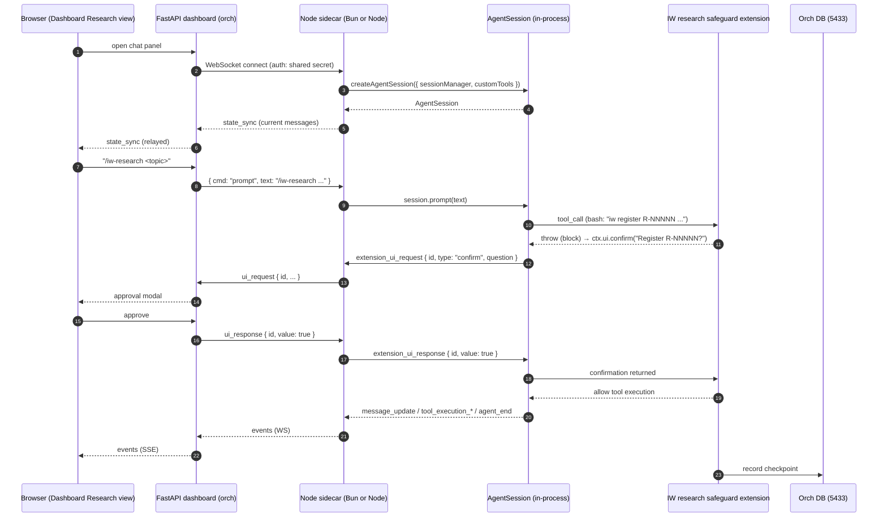
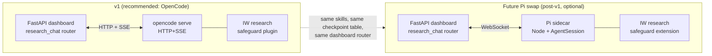

# R-00072 — Embedding Pi (pi.dev) Behind the IW AI Core Dashboard

| Field | Value |
|-------|-------|
| ID | R-00072 |
| Date | 2026-05-14 |
| Mode | deep |
| Editorial category | technical |
| Status | draft |

**Primary question** — Can we embed Pi (pi.dev, package `@earendil-works/pi-coding-agent` / `@mariozechner/pi-coding-agent`) behind the IW AI Core FastAPI dashboard to drive `/iw-research` end-to-end from the browser (single-user, single-session, full execution with safeguards, not Claude-locked), and how does its integration shape compare head-to-head with OpenCode's (R-00071)?

---

## Executive Summary

**Pi is technically embeddable but is the wrong fit for our specific stack.** Pi ships [four execution modes](https://pi.dev/docs/latest) — interactive TUI, print (`-p`), JSON Event Stream (`--mode json`), and **RPC (`--mode rpc`)** — plus an [in-process Node.js SDK (`@earendil-works/pi-coding-agent`)](https://pi.dev/docs/latest/sdk) and a [Lit-based web-component library `@earendil-works/pi-web-ui`](https://www.npmjs.com/package/@mariozechner/pi-web-ui). It is [MIT-licensed](https://github.com/earendil-works/pi), provider-neutral across 30+ LLMs ([Anthropic, OpenAI, Google, Bedrock, Azure, Ollama, LM Studio, vLLM, etc.](https://pi.dev/docs/latest/providers)), and explicitly **Agent-Skills-standard-compliant** — it reads skills from `.pi/skills/`, `.agents/skills/`, **AND** `~/.claude/skills/` / `~/.codex/skills/` via a `skills` array in settings. Crucially, the maintainer ([Mario Zechner / badlogic](https://mariozechner.at/posts/2025-11-30-pi-coding-agent/)) **explicitly rejects MCP** as bloated and **does not ship an HTTP server mode** like OpenCode's `opencode serve`.

For our **Python-backed FastAPI dashboard**, that last point is the structural problem. The supported non-Node integration path is **RPC mode**: spawn `pi --mode rpc` as a subprocess and communicate over strict LF-delimited JSONL on stdin/stdout. This works — the protocol is well-documented, the [pi-remote-web-ui reference project](https://github.com/VVander/pi-remote-web-ui) demonstrates the pattern (in Node, via WebSocket relay), and the [Pi RPC docs](https://pi.dev/docs/latest/rpc) list the full command/event vocabulary. But it is meaningfully more work than OpenCode's HTTP+SSE surface: we have to (a) own a long-lived subprocess from FastAPI, (b) implement strict LF-only JSONL framing in Python (Python's default line readers split on Unicode separators and will break Pi's protocol if any tool output contains those characters), and (c) build our own permission-approval bridge because Pi routes approvals through an in-process **Extension UI Protocol** with `extension_ui_request`/`extension_ui_response` messages, not a first-class permission event with a documented REST endpoint.

The **embedding ecosystem is much smaller** than OpenCode's: the most relevant analog, [VVander/pi-remote-web-ui](https://github.com/VVander/pi-remote-web-ui), is 21 stars / 7 commits / "no releases published" — a proof-of-concept, not a battle-tested template. The [official `@mariozechner/pi-web-ui` Lit components](https://www.npmjs.com/package/@mariozechner/pi-web-ui) explicitly expect an **in-process Node `Agent` instance** as their backend ("does not expose HTTP/WebSocket protocols directly … expects integration with the `Agent` class from `@earendil-works/pi-agent-core`"). Compared to OpenCode's seven independent web UIs + official VS Code extension + Go SDK + Vercel-AI-SDK provider, Pi's proof-points are thin.

There are genuine **wins on the Pi side** worth folding into our design even if we don't pick Pi as the runtime: a richer extension API (custom UI dialogs, slash commands, message renderers, autocomplete providers, model-select hooks, `tool_call` blockable hook); explicit Agent-Skills-standard compliance with [multi-harness skill discovery from `.claude/`, `.codex/`, `.pi/`, `.agents/`](https://pi.dev/docs/latest/skills); a tiny, deliberately-minimal system prompt and tool surface (sub-1000-token total, per the [author's blog post](https://mariozechner.at/posts/2025-11-30-pi-coding-agent/)); transparent session storage as JSONL-with-tree-branching at `~/.pi/agent/sessions/`; and a hard line on observability ("Exactly controlling what goes into the model's context yields better outputs", same source). Pi's philosophy will inform R-C and the synthesis; it should not, on this evidence, be the runtime for v1.

**Recommendation for v1:** **adopt OpenCode (R-00071) as the runtime.** Keep Pi in scope as a *parallel-track future option* worth a 1–2 day spike once R-C is filed and the v1 ships, primarily because of its skill-standard alignment and lighter context budget. If we later move to Pi, the path is: write a Node sidecar that wraps `createAgentSession()` from `@earendil-works/pi-coding-agent`, exposes a WebSocket bridge to FastAPI (the [pi-remote-web-ui pattern](https://github.com/VVander/pi-remote-web-ui)), and implements the Extension UI Protocol relay. The skills don't need to change — Pi will discover the same `skills/iw-research/SKILL.md` we already maintain.

---

## Background

Pi was suggested by the user as a lightweight alternative to Claude Code and OpenCode for the dashboard's interactive Research chat. The pre-read of `pi.dev/docs/latest` (recorded in the conversation that produced this research) confirmed Pi has documented SDK / RPC / JSON Event Stream modes, custom extensions, and a Lit web-component library — all promising signals for embedding. This research goes one level deeper than that pre-read: it captures the actual command surface, identifies the structural mismatch with a Python backend, surveys real embeddings, and provides a head-to-head comparison with the OpenCode findings filed yesterday (R-00071).

---

## Findings

### 1. SDK API surface — Node-library-first, no HTTP server [HIGH]

The SDK is `npm install @earendil-works/pi-coding-agent` (also published as `@mariozechner/pi-coding-agent`). It exposes two factories ([SDK docs](https://pi.dev/docs/latest/sdk)):

```javascript
// Single session
const { session } = await createAgentSession({
  sessionManager: SessionManager.inMemory(),
  authStorage,
  modelRegistry,
  customTools: [...],
});

// Runtime (manages session replacement; used internally by interactive/RPC modes)
const runtime = await createAgentSessionRuntime(createRuntime, {
  cwd: process.cwd(),
  agentDir: getAgentDir(),
  sessionManager: SessionManager.create(process.cwd()),
});
```

`AgentSession` exposes (`source: SDK docs`):

```
session.prompt(text, options)          // send prompt
session.steer(text)                    // queue a message mid-stream
session.followUp(text)                 // queue for after current turn
session.messages, session.agent, session.model, session.isStreaming
session.setModel(model), session.setThinkingLevel(level), session.cycleModel()
session.navigateTree(targetId, options)
session.compact(customInstructions)
session.abort()
session.dispose()
session.subscribe(handler)             // returns unsubscribe()
```

Event types delivered to `subscribe()` include `message_update` (with `text_delta`), `tool_execution_start/update/end`, `agent_start/end`, `turn_start/end`, `queue_update`, `compaction_start/end`, `auto_retry_start/end`, `extension_error`.

**There is no HTTP-server factory.** The official guidance for non-Node integration is "RPC mode is preferred when: You're integrating from another language… You want process isolation." ([SDK docs](https://pi.dev/docs/latest/sdk)). For a Python backend the two paths are:

1. **Spawn `pi --mode rpc` as a subprocess** and speak LF-delimited JSONL on its stdin/stdout (see §2).
2. **Write a Node sidecar** that imports `@earendil-works/pi-coding-agent`, instantiates `AgentSession` in-process, and exposes its own HTTP/WebSocket surface — this is exactly what [VVander/pi-remote-web-ui](https://github.com/VVander/pi-remote-web-ui) does, but in Node-talking-to-Node.

### 2. RPC mode — Pi's actual integration surface for non-Node consumers [HIGH]

[RPC mode](https://pi.dev/docs/latest/rpc) is invoked with `pi --mode rpc [options]`. Common flags: `--provider <name>`, `--model <pattern>`, `--no-session` (ephemeral), `--session-dir <path>`. **Framing is strict LF-only JSONL.** From the docs: "RPC mode uses strict JSONL semantics with LF (`\n`) as the only record delimiter. Clients must split on `\n` only and strip trailing `\r`. Standard line readers like Node's `readline` are incompatible because they split on Unicode separators within JSON strings." **Python's `for line in proc.stdout` will misbehave** the moment a tool output contains a Unicode separator inside a JSON string. We must read raw bytes and split on `0x0A` only.

**Input commands** (one JSON object per line on stdin):

| Group | Commands |
|-------|----------|
| Prompting | `prompt` (with optional images), `steer`, `follow_up`, `abort` |
| State | `get_state`, `get_messages` |
| Model | `set_model`, `cycle_model`, `get_available_models` |
| Thinking | `set_thinking_level`, `cycle_thinking_level` |
| Queue modes | `set_steering_mode`, `set_follow_up_mode` |
| Compaction | `compact`, `set_auto_compaction` |
| Retry | `set_auto_retry`, `abort_retry` |
| Bash (host) | `bash`, `abort_bash` |
| Session | `new_session`, `get_session_stats`, `export_html`, `switch_session`, `fork`, `clone`, `get_fork_messages`, `get_last_assistant_text`, `set_session_name` |
| Other | `get_commands` |

**Output events** (interleaved on stdout):

| Group | Events |
|-------|--------|
| Lifecycle | `agent_start`, `agent_end`, `turn_start`, `turn_end` |
| Messages | `message_start`, `message_update` (streaming, with `delta`), `message_end` |
| Tools | `tool_execution_start`, `tool_execution_update`, `tool_execution_end` |
| Queue | `queue_update` |
| Compaction | `compaction_start`, `compaction_end` |
| Retry | `auto_retry_start`, `auto_retry_end` |
| Errors | `extension_error` |
| **UI / Approvals** | `extension_ui_request` (blocks until client sends matching `extension_ui_response`) |

During streaming, new `prompt` commands require `streamingBehavior: "steer"` (queues mid-turn) or `"followUp"` (waits until done). Auth is **not** documented as part of RPC — it inherits the host's provider auth (env vars or `~/.pi/agent/auth.json` from a prior `/login` OAuth dance).

**Concrete shape** (from the README example):

```bash
pi --mode rpc --no-session
```

```
> {"type":"prompt","message":"Hello!"}\n
< {"type":"agent_start"}\n
< {"type":"turn_start"}\n
< {"type":"message_update","message":{...},"assistantMessageEvent":{"type":"text_delta","delta":"Hi"}}\n
< {"type":"message_end","message":{...}}\n
< {"type":"agent_end","messages":[...]}\n
< {"type":"response","ok":true}\n
```

### 3. JSON Event Stream mode — one-shot only, not a session driver [HIGH]

[`pi --mode json "Your prompt"`](https://pi.dev/docs/latest/json) is **one-shot**: the prompt is a CLI argument, the agent runs to completion, every event is emitted as JSONL to stdout, and the process exits. The event vocabulary is the same as RPC mode (`agent_start`, `turn_start`, `message_*`, `tool_execution_*`, `turn_end`, `agent_end`) plus a session header (`{"type":"session","version":3,"id":"...","cwd":"..."}`) as the first line.

This mode is **not suitable** for our use case: it can't chain prompts, can't be steered mid-stream, and has no documented permission/approval surface. It is built for scripting (`pi --mode json "list .ts files" | jq -c 'select(.type=="message_end")'`), not for an interactive dashboard chat. RPC mode is the only viable persistent-session option for non-Node consumers.

### 4. Skills, Extensions, Prompt Templates — best-in-class compatibility, no MCP [HIGH]

**Skills.** Pi implements the [Agent Skills standard](https://pi.dev/docs/latest/skills) and discovers from multiple locations in priority order:

```
~/.pi/agent/skills/<name>/SKILL.md         # global
~/.agents/skills/<name>/SKILL.md           # global, agent-spec
.pi/skills/<name>/SKILL.md                 # project
.agents/skills/<name>/SKILL.md             # project, agent-spec (walked up to git root)
skills/ in any Pi package
pi.skills entries in package.json
plus paths from --skill <path> or the settings.json `skills` array
```

The standard explicitly supports configuring **Claude Code and OpenAI Codex** skill directories: `{ "skills": ["~/.claude/skills", "~/.codex/skills"] }` ([source](https://pi.dev/docs/latest/skills)). Our `skills/iw-research/SKILL.md` (already in the format Pi requires — name regex `^[a-z0-9]+(-[a-z0-9]+)*$`, max 64 chars; description max 1024 chars; optional `license`, `compatibility`, `metadata`, plus Pi-specific `allowed-tools`, `disable-model-invocation`) **works as-is without any porting**. Skills are exposed to the LLM via "progressive disclosure" (name + description in the system prompt; full content loaded on-demand when the model invokes the skill, or via the explicit `/skill:<name>` slash command).

**Extensions.** Pi's extension system is meaningfully more powerful than OpenCode's plugin system. From the [Extensions docs](https://pi.dev/docs/latest/extensions): "Extensions are TypeScript modules that extend pi's behavior. They can subscribe to lifecycle events, register custom tools callable by the LLM, add commands, and more." The hook catalogue is large:

- **Session**: `session_start`, `session_before_switch`, `session_before_fork`, `session_before_compact`, `session_compact`, `session_before_tree`, `session_tree`, `session_shutdown`
- **Agent**: `before_agent_start` (can inject message or modify system prompt), `agent_start`, `agent_end`, `turn_start`, `turn_end`, `message_start`, `message_update`, `message_end`
- **Tool**: `tool_call` (**can block execution by throwing**), `tool_execution_start/update/end`, `tool_result` (**can modify result before LLM sees it**)
- **Model/Provider**: `context` (modify messages pre-LLM), `before_provider_request` (inspect/replace payload), `after_provider_response`, `model_select`, `thinking_level_select`
- **Input/UI**: `input` (transform or handle without LLM), `user_bash`, `resources_discover`

Plus the extension can `pi.registerTool({...})`, `pi.registerCommand("name", {...})`, `pi.registerProvider(...)`, `pi.registerShortcut(...)`, `pi.registerFlag(...)`, `pi.registerMessageRenderer(...)` and call `ctx.ui.select/confirm/input/editor/notify` for user interaction (this is the **Extension UI Protocol** that becomes `extension_ui_request` events over RPC).

Extensions **run in-process with full Node permissions** — the [official docs warn](https://pi.dev/docs/latest/extensions): "Extensions run with your full system permissions and can execute arbitrary code. Only install from sources you trust." Locations:

```
~/.pi/agent/extensions/*.ts          # global
~/.pi/agent/extensions/*/index.ts
.pi/extensions/*.ts                  # project
.pi/extensions/*/index.ts
plus -e <path> repeatable and npm/git packages via `pi install`
```

**Prompt Templates.** Markdown files with argument substitution (`$1`, `$ARGUMENTS`), the same shape as OpenCode's commands. Our existing `commands/iw-research.md` is one minor format check away from being a Pi Prompt Template (Pi's frontmatter differs slightly — uses `template` body convention rather than `description`-first frontmatter, but the markdown body is reusable).

**MCP — explicitly rejected.** The Pi author writes ([blog](https://mariozechner.at/posts/2025-11-30-pi-coding-agent/)): "MCP servers are overkill for most use cases, and they come with significant context overhead. Playwright MCP dumps 13.7k tokens; Chrome DevTools MCP, 18k. He advocates CLI tools with READMEs instead." Pi does not ship MCP support and is unlikely to add it. **This is a deal-breaker if we ever want our dashboard to expose tools back to the agent as an MCP server** (a pattern that would let other agents — Claude Code, OpenCode — also reach into IW AI Core via the same surface). It is a non-issue if we accept that Pi's CLI-tools-plus-readme model is sufficient.

### 5. Session storage — JSONL trees, transparent and inspectable [HIGH]

Sessions are stored as JSONL files at `~/.pi/agent/sessions/--<path>--/<timestamp>_<uuid>.jsonl` ([Session Format docs](https://pi.dev/docs/latest/session-format)). Each entry is a discrete JSON line with `type`, `id` (8-char hex), `parentId`, `timestamp`. Entry types: `message`, `model_change`, `thinking_level_change`, `compaction`, `branch_summary`, `custom`, `custom_message`, `label`, `session_info`. The first line is the session header (`{"type":"session","version":3,...}`, optional `parentSession` for forks).

**Tree-with-branching is first-class**: every entry has a `parentId`, multiple children are valid, and the "leaf" (current position) can be moved with `branch()` methods. This is more elegant than OpenCode's snapshot-per-step model but harder to reason about for our checkpoint flow.

**Cross-process locking is not documented** — sessions are referenced by file path or UUID via the `SessionManager` API. For our single-user, single-session constraint this isn't a problem. For any future multi-session use we would need to enforce session ownership at the FastAPI layer ourselves.

**Resume**: via `pi -c` (continue most recent), `pi -r` (browse and select), `pi --session <path|id>`, or `pi --fork <path|id>` (new session from checkpoint).

### 6. Provider portability — strong, no Claude lock-in [HIGH]

Pi supports the broadest provider set we've seen ([Providers docs](https://pi.dev/docs/latest/providers)). Subscription/OAuth: ChatGPT Plus/Pro (Codex), Claude Pro/Max (with a usage caveat), GitHub Copilot. API key: Anthropic, Azure OpenAI, OpenAI, DeepSeek, Google Gemini, Mistral, Groq, Cerebras, xAI, OpenRouter, Vercel AI Gateway, ZAI, OpenCode Zen/Go, Hugging Face, Fireworks, Together AI, Kimi For Coding, MiniMax, Xiaomi MiMo. Cloud: Amazon Bedrock (with automatic Claude prompt-caching), Azure OpenAI, Google Vertex AI, Cloudflare AI Gateway/Workers AI. Local: "Add Ollama, LM Studio, vLLM, or any provider that speaks a supported API" via `~/.pi/agent/models.json`.

The maintainer built [his own unified LLM SDK `pi-ai`](https://mariozechner.at/posts/2025-11-30-pi-coding-agent/) rather than depending on Vercel AI SDK ("Building on top of the provider SDKs directly gives me full control and lets me design the APIs exactly as I want"), and the result is provider-neutral by construction. Anthropic-specific behaviors (Bedrock prompt-cache) are isolated to the provider adapter. **There is no Claude lock-in.**

Per-prompt model override is supported (`--model`, `set_model` over RPC). Per-extension provider registration is supported (`pi.registerProvider(...)`).

### 7. Tool-use, permissions, and sandbox — manual and DIY [HIGH]

Pi's design philosophy is explicit ([author's blog](https://mariozechner.at/posts/2025-11-30-pi-coding-agent/)): "Full filesystem access. Can execute any command with your user privileges." Tools include `read`, `bash`, `edit`, `write`, `grep`, `find`, `ls`. There is **no built-in permission prompt** comparable to OpenCode's `permission.asked` / 3-level allow-ask-deny model. The author writes: "once an agent can write and execute code, security theater doesn't prevent exfiltration; containment (containers/VMs) is the real solution."

The [Pi sandbox analysis report](https://agent-safehouse.dev/docs/agent-investigations/pi) confirms this and recommends mitigations:

- "Pi does **NOT** sandbox tool execution by default."
- Credentials in `~/.pi/agent/auth.json` (mode `0o600`) are well-handled; tool execution is not.
- "Enable the optional sandbox extension (`pi -e ./sandbox`) using `@anthropic-ai/sandbox-runtime`"
- Container-based isolation for production
- Restrict network egress
- Implement filesystem scoping to working directory and `~/.pi/agent/`
- "All tools run with the user's full permissions, making direct exposure dangerous without isolation mechanisms"

**Approvals via extensions.** The way to require user confirmation for a tool is to register an extension with a `tool_call` hook that calls `ctx.ui.confirm("Approve?")` — over RPC this becomes an `extension_ui_request` event that the client must answer with `extension_ui_response`. So the *mechanism* for approval flows exists; it's just not built in. We would have to ship a small TypeScript extension to recreate the safeguards we get for free with OpenCode's permission system.

### 8. Real OSS embeddings — one credible example; ecosystem is small [HIGH]

The closest analog to our use case is **[VVander/pi-remote-web-ui](https://github.com/VVander/pi-remote-web-ui)** — and it's the right pattern to study:

- **Architecture**: "A single `AgentSession` instance runs inside the server process. All browser tabs share the same conversation — events are broadcast to every connected client in real time." Exactly the in-process-AgentSession + WebSocket-relay pattern the Pi maintainer recommends.
- **Stack**: Node.js + TypeScript, Vite, WebSocket for client/server, in-process `AgentSession` from the SDK.
- **Auth**: SSH port forwarding only. "Server binds **exclusively to `127.0.0.1`** (localhost only). … No passwords, tokens, or TLS certificates required — authentication via SSH keys."
- **State sync on connect**: "When a new tab connects, it receives the full conversation history via a `state_sync` message."
- **Maturity**: **21 stars, 7 commits, no releases, no license file**. A reference implementation, not a battle-tested library.

Other ecosystem points:

- **[@mariozechner/pi-web-ui](https://www.npmjs.com/package/@mariozechner/pi-web-ui)** — official-ish Lit web components (`ChatPanel`, `AgentInterface`, `ArtifactsPanel`, `SettingsDialog`, `SessionListDialog`, `ApiKeyPromptDialog`, `ModelSelector`). Built with mini-lit + Tailwind v4. Expects an **in-process Agent instance** ("does not expose HTTP/WebSocket protocols directly"), so on its own it does **not** solve the Python-backend problem — it solves the "I have a Node server and want chat UI for it" problem.
- **OpenClaw** — referenced in [a tutorial](https://gist.github.com/dabit3/e97dbfe71298b1df4d36542aceb5f158) as "the agent stack powering OpenClaw." Not directly inspectable; the tutorial gist is the trace.
- **[Dicklesworthstone/pi_agent_rust](https://github.com/Dicklesworthstone/pi_agent_rust)** — a Rust reimplementation of the agent harness. Demonstrates that the design is influential enough to be ported but isn't an embedding example.
- **[can1357/oh-my-pi](https://github.com/can1357/oh-my-pi)** — derivative/fork of the harness with additional tools (LSP, Python, browser, subagents, hash-anchored edits). Again, alternate harness, not embedding.
- **[pi-mono CHANGELOG](https://github.com/badlogic/pi-mono/blob/main/packages/coding-agent/CHANGELOG.md)** — long file (4178 lines), not fully captured; pi-coding-agent is on v0.74 as of May 2026, 214 releases over the project's life, active dev.

Compared to OpenCode's seven independent web UIs (R-00071 §7) plus official VS Code extension, Go SDK, Vercel-AI-SDK-provider, and ~50 community packages on [awesome-opencode](https://github.com/awesome-opencode/awesome-opencode), **Pi's web-embedding ecosystem is ~1 credible reference project + ~1 official Lit UI library**. The protocol is documented; the production proof is thin.

### 9. v1 architecture recommendation **if we picked Pi** — Node sidecar + WebSocket bridge [HIGH]

If we chose Pi as the runtime (we do not recommend this for v1; see §10 + Recommendations), the architecture would look like:



**Components**:

- **Node sidecar** — small Bun (or Node) process owned by the FastAPI daemon (managed subprocess). Imports `@earendil-works/pi-coding-agent`, creates one `AgentSession` (single-user, single-session constraint), exposes a `WebSocket` server on `127.0.0.1`. Forwards events out, accepts commands in. Implements the `extension_ui_request`/`extension_ui_response` relay.
- **IW safeguard extension** — TypeScript file in `.pi/extensions/iw-research-safeguards/index.ts`. Subscribes to `tool_call`, intercepts `bash` commands matching `iw register|doc-update`, performs idempotency check, calls `ctx.ui.confirm()` for the registration step, records completion in the orch DB.
- **FastAPI relay** — `dashboard/routers/research_chat.py` opens a WebSocket to the sidecar, exposes SSE to the browser, maintains a ring buffer for tab-refresh resilience.
- **Alternative: RPC subprocess** — skip the Node sidecar and have FastAPI itself spawn `pi --mode rpc` and speak JSONL on stdin/stdout. Requires a custom LF-only line splitter in Python (Python's default readers will break Pi's protocol if any tool output contains Unicode separators). Saves a runtime but loses the type-safe SDK ergonomics and forces us to maintain the RPC wire format ourselves.

**Idempotent checkpoints**: same scheme as R-00071 (`research_session_state` keyed by `(pi_session_uuid, step)`), implemented inside the safeguard extension's `tool_call` and `tool_execution_end` hooks.

**Cancellation**: extension calls `ctx.abort()` *or* the client sends an `abort` RPC command / WebSocket message. Pi's session abort propagates through the agent loop and partial-tool-call mid-execution is supported per the [author's blog post](https://mariozechner.at/posts/2025-11-30-pi-coding-agent/) ("Pi-ai supports request abortion throughout the pipeline, including mid-tool-call").

**Disconnect / reconnect**: the FastAPI relay holds the sidecar WebSocket; browser tabs reattach to the relay and receive the buffered state. Sidecar crash → FastAPI restarts it and resumes the session from `SessionManager.continueRecent(cwd)`.

**What we lose vs the OpenCode embedding**:
- A second runtime (Node sidecar) to deploy, observe, and update
- A custom LF-only JSONL parser if we go subprocess-only
- A custom permission/approval pipeline (Pi has no built-in `permission.asked` event)
- An ecosystem of comparable web UIs to crib from
- Built-in MCP support
- HTTP/SSE language-neutrality

### 10. Head-to-head: Pi vs OpenCode [HIGH]

| Axis | OpenCode (R-00071) | Pi (this doc) | Winner for our use case |
|------|--------------------|---------------|-------------------------|
| Integration surface for FastAPI | First-class HTTP+SSE server (`opencode serve`), OpenAPI 3.1 spec, official JS/TS + Go SDKs | Node-library-first SDK + RPC mode (LF-only JSONL on subprocess stdin/stdout) + JSON Event Stream (one-shot only). No HTTP server. | **OpenCode** — significant Python-backend ergonomics win. |
| Session lifecycle | REST CRUD; per-step git snapshots; `POST /session/:id/abort`; SSE-based event bus | JSONL file-tree with branching; abort via RPC; no native rollback (but elegant fork/clone) | OpenCode slightly cleaner for an HTTP-driven dashboard; Pi's tree model is arguably more elegant for branched exploration. **OpenCode marginal win.** |
| Skill format & discovery | Walks up to git worktree; reads `.opencode/`, `.claude/`, `.agents/` — explicit Claude-compat | Walks up to git root; reads `.pi/`, `.agents/`, and via settings also `~/.claude/`, `~/.codex/` — fully Agent-Skills-standard-compliant | **Tied** — both work with our existing format. Pi has slightly broader cross-harness discovery; OpenCode has stronger feature-parity with our existing skills. |
| Slash commands / prompt templates | `.opencode/commands/*.md` with frontmatter (`template`, `agent`, `model`, `subtask`) | `.pi/prompts/*.md` (Prompt Templates) plus `/skill:<name>` for skills | **Tied** — minor frontmatter differences only. |
| Permission / approval model | Built-in 3-level (allow/ask/deny) with glob patterns; first-class `permission.asked` SSE event + REST reply endpoint | DIY via an extension calling `ctx.ui.confirm()`; over RPC, surfaces as `extension_ui_request` event | **OpenCode** — built-in safety hooks save us from building this. |
| Plugin / extension API | Plugins with `tool.execute.before/after`, `permission.asked`, `session.idle`, `shell.env`, etc. Can throw to block. | Extensions are richer: `tool_call`/`tool_result` (block/modify), `before_provider_request`, `before_agent_start` (mutate system prompt), custom UI dialogs, autocomplete providers, message renderers, custom tools, custom commands, shortcuts, flags | **Pi** for extensibility ceiling; OpenCode is sufficient for our v1 needs. |
| MCP support | Full first-class (local + remote, OAuth, glob allow-lists) | **Explicitly rejected** by author philosophy | **OpenCode** — preserves future portability. |
| Multi-provider | 75+ via Vercel AI SDK | 30+ via author's own pi-ai SDK | **Tied in practice.** OpenCode wider; Pi well-curated. Both Claude-portable. |
| Embedding ecosystem | 7 third-party web UIs (the most active: 177★, 123★), official VS Code extension, Go SDK, Vercel-AI-SDK-provider, awesome-opencode list | 1 reference web UI (21★, 7 commits), 1 official Lit-components library (no HTTP surface), some forks/derivatives | **OpenCode** — massively more proof-points to crib from. |
| Maturity | v1.14.x; one known regression (SSE compression v1.14.42–46) | v0.74; pre-1.0; very active dev (214 releases) | **OpenCode** marginally; Pi is younger but moving fast. |
| Context budget per turn | "Thousands of tokens" of system prompt + tool defs | Sub-1000 tokens total — explicit design goal | **Pi** — cheaper inference, better signal-to-noise; OpenCode is heavier. |
| Sandbox / blast radius | Built-in allow/ask/deny + plugins that can block | No built-in sandbox; optional `pi -e ./sandbox` extension using `@anthropic-ai/sandbox-runtime`; rest is "use a container" | **OpenCode** — better default safety; both ultimately require containerization for production. |
| Author's stance toward third-party UIs | Welcoming (publishes SDK, OpenAPI spec, encourages third-party clients) | Welcoming but Node-centric (publishes SDK, Lit components, references community web UIs) | **OpenCode** — has cultivated a broader integration ecosystem. |
| License | MIT (sst/opencode) | MIT (earendil-works/pi) | **Tied.** |

**Net for v1**: OpenCode is the clear pick on integration ergonomics, ecosystem maturity, built-in safety, and MCP portability. Pi's wins (cheaper context, richer extension API, transparent session format, philosophy of minimalism) are real but don't outweigh the structural mismatch of a Node-library-first agent talking to a Python web backend.

### 11. Risks and pitfalls specific to Pi [HIGH / MEDIUM]

| Risk | Severity | Mitigation |
|------|----------|-----------|
| **No HTTP server mode** — non-Node integration is subprocess+JSONL or a Node sidecar | HIGH | Use a Node sidecar with WebSocket relay (the pi-remote-web-ui pattern), or accept the RPC-subprocess complexity. Either way, +1 process/runtime vs OpenCode. |
| **LF-only JSONL framing — Python defaults will break the protocol** | HIGH | Write a raw-bytes reader that splits on `\n` only. Cover this with a regression test that includes Unicode separators in tool output. Don't use `for line in proc.stdout`. |
| **No built-in permission/approval system** | HIGH | Ship a safeguard extension. Carry the cost of writing + maintaining the Extension UI Protocol relay across two layers (Python relay + Node extension). |
| **Smaller embedding ecosystem** — 1 reference project at 21★ | HIGH | Pattern is well-documented but production-bleed will be ours to discover. Allocate explicit prototype time. |
| **No MCP support — explicit author rejection** | MEDIUM | If we later need to expose IW AI Core tools to other agents, MCP would be the canonical surface; with Pi, we'd build CLI tools with READMEs (per the author's prescription). Workable, but a structural decision. |
| **Sandbox** — tools run as the user with no default isolation | MEDIUM | Enable the `sandbox` extension; restrict the working directory; container the whole stack. |
| **Extension code runs in-process with full system permissions** | MEDIUM | Same as OpenCode plugins — our extensions are our code; review accordingly. |
| **Pre-1.0 (v0.74)** — protocol/API stability is "moving" | MEDIUM | Version-pin. Subscribe to the changelog. Plan a maintenance budget for each Pi minor bump. |
| **CHANGELOG churn — 4178 lines, 214 releases** | LOW | Active dev is positive; just track it. |
| **Auth on RPC mode is undocumented** — falls back to env vars / prior `/login` OAuth | LOW | Set `ANTHROPIC_API_KEY` (or the provider of choice) in the subprocess env. Document this. |
| **`@mariozechner/pi-web-ui` Lit components have no HTTP surface** | LOW | If we ever want to use the official chat-UI components, we'd need the Node sidecar to host the page — not the FastAPI dashboard directly. |
| **Star-count claim of 49.4k on `earendil-works/pi`** is from a WebFetch summary that may have hallucinated | LOW | Treat as unverified; the ecosystem-size evidence rests on the small number of third-party embeddings, not on the headline star count. |

---

## Architecture Recommendation (summary)

**Do not adopt Pi as the runtime for v1.** The structural cost (Node sidecar OR custom Python LF-JSONL parser + DIY permission flow + thinner ecosystem to learn from) buys us features (richer extensions, smaller context budget, transparent session format) that are not on the critical path for the v1 user story.

**Do keep Pi in scope as a parallel-track future option** worth a 1–2 day spike post-v1:
- Pi's Agent-Skills-standard compliance with multi-harness discovery is the cleanest skill-portability story available — our `/iw-research` skill works in Pi, OpenCode, *and* Claude Code without modification.
- Pi's sub-1000-token context budget is a real running-cost advantage if we scale chat usage.
- Pi's extension API gives a path to features OpenCode's plugin system can't reach (custom UI components, autocomplete, message renderers).
- The Pi maintainer (Mario Zechner / badlogic) has a clear, articulated design philosophy that aligns with how we already build (transparent state, file-backed skills, minimal prompt).

If we later swap to Pi, the change is contained:
1. Add a Node sidecar (`orch/research_chat/pi_sidecar/`) wrapping `@earendil-works/pi-coding-agent`.
2. Replace `opencode_client.py` with a thin WebSocket client.
3. Port the OpenCode TypeScript safeguard plugin to a Pi Extension.
4. Keep `skills/iw-research/SKILL.md`, `dashboard/routers/research_chat.py`, and the `research_session_state` table unchanged.

The OpenCode-shaped abstractions chosen in R-00071 are deliberately runtime-agnostic enough to make this swap a few hundred lines of code, not a redesign.



---

## Recommendations

1. **Primary**: For v1, **do not embed Pi**. Adopt OpenCode per R-00071. The Python-backend / HTTP-SSE / built-in-permission alignment is decisive; Pi's structural mismatch (Node-library-first, DIY permission flow, smaller ecosystem) costs more engineering than its features earn for our specific user story.

2. **Alternative**: A **Pi sidecar in Node** behind FastAPI is technically viable and well-precedented by [pi-remote-web-ui](https://github.com/VVander/pi-remote-web-ui). Prefer this **only** if (a) OpenCode is later shown unfit, or (b) we explicitly want Pi's smaller context budget and richer extension API and accept the two-runtime cost. The pattern is: in-process `AgentSession` in the sidecar, WebSocket relay to FastAPI, custom safeguard extension implementing the approval flow over `extension_ui_request`/`response`.

3. **Avoid**: Driving Pi from FastAPI via `pi --mode rpc` subprocess as the sole integration path. It works on paper but layers three avoidable problems on top of each other — LF-only JSONL parsing in Python, manual extension UI protocol relay, and runtime auth/env management for the subprocess — none of which OpenCode's HTTP+SSE has.

4. **Avoid**: Using Pi's JSON Event Stream Mode (`--mode json`) for the chat. It is one-shot, can't be steered mid-stream, and doesn't expose approvals. Useful for scripts, not for an interactive dashboard.

5. **Do regardless of runtime choice**: align our skills with the Agent Skills standard (Pi already enforces this; OpenCode is compatible). Specifically, the `name` regex `^[a-z0-9]+(-[a-z0-9]+)*$` ≤ 64 chars, the `description` ≤ 1024 chars, and treat the SKILL.md body as relative-path-resolved-from-skill-directory. Both runtimes will then load us identically, which preserves the future option to switch.

---

## Limitations

- The pi.dev docs were the primary source; the codebase was not read directly. Some details — exact session-resume locking semantics, the precise abort timing for partially-completed tool calls, the full event payload schemas for `extension_ui_request` — would benefit from a one-day reading of `packages/coding-agent/src/` in [pi-mono](https://github.com/badlogic/pi-mono) or [earendil-works/pi](https://github.com/earendil-works/pi).
- The 49,400-star count returned by the WebFetch summary for `earendil-works/pi` was not independently verified and may be inflated. The ecosystem-size argument (1 reference web UI, 1 official Lit-components library) rests on the embedding-project count, not on the headline star number — that conclusion is robust to a much smaller real star count.
- The CHANGELOG fetch did not return content; "v0.74 in May 2026, 214 releases" is taken from secondary fetches and is consistent across sources but not verbatim-confirmed.
- No first-hand prototype was built; the recommendation rests on documented surfaces. A 1-day spike that wires `pi --mode rpc` against our `iw-research` skill from a Python script would convert several MEDIUM-confidence claims to HIGH (in particular, the practical pain of LF-only JSONL framing in Python).
- The sandbox analysis report at [agent-safehouse.dev](https://agent-safehouse.dev/docs/agent-investigations/pi) is a third-party source with unknown editorial standards. Its findings line up with the maintainer's own blog post, so the conclusions are mutually corroborated, but neither was treated as authoritative on its own.
- This research does not evaluate Pi against Claude Code directly — only against OpenCode, since Claude Code is already the implicit baseline (the existing `/iw-research` CLI invocation). The Claude Code comparison falls out implicitly from R-A and R-C.
- The decision to prefer OpenCode for v1 is **conditional on the project remaining single-user, single-session, with full execution from the chat**. If the constraints change (multi-tenant, sandbox-first, very tight inference budget, or no MCP requirement), Pi's profile may rebalance.

---

## Sources

| # | Source | Credibility | URL |
|---|--------|-------------|-----|
| 1 | Pi — Documentation index (latest) | HIGH | https://pi.dev/docs/latest |
| 2 | Pi — SDK (`createAgentSession`, AgentSession methods, event types) | HIGH | https://pi.dev/docs/latest/sdk |
| 3 | Pi — RPC mode (commands, events, JSONL framing) | HIGH | https://pi.dev/docs/latest/rpc |
| 4 | Pi — JSON Event Stream mode (one-shot, session header, events) | HIGH | https://pi.dev/docs/latest/json |
| 5 | Pi — Skills (filesystem layout, Agent-Skills-standard, multi-harness discovery) | HIGH | https://pi.dev/docs/latest/skills |
| 6 | Pi — Extensions (TypeScript modules, hook catalogue, UI protocol) | HIGH | https://pi.dev/docs/latest/extensions |
| 7 | Pi — Session Format (JSONL trees, branching) | HIGH | https://pi.dev/docs/latest/session-format |
| 8 | Pi — Providers (subscription + API-key list, custom providers) | HIGH | https://pi.dev/docs/latest/providers |
| 9 | pi-coding-agent README on GitHub (CLI flags, modes, SDK examples, license MIT) | HIGH | https://github.com/badlogic/pi-mono/blob/main/packages/coding-agent/README.md |
| 10 | earendil-works/pi monorepo overview | MEDIUM | https://github.com/earendil-works/pi |
| 11 | badlogic/pi-mono monorepo (mirror of earendil-works/pi) | MEDIUM | https://github.com/badlogic/pi-mono |
| 12 | Mario Zechner — "What I learned building an opinionated and minimal coding agent" (design philosophy, anti-MCP stance) | HIGH | https://mariozechner.at/posts/2025-11-30-pi-coding-agent/ |
| 13 | VVander/pi-remote-web-ui — reference web-UI (in-process AgentSession + WebSocket relay) | HIGH | https://github.com/VVander/pi-remote-web-ui |
| 14 | @mariozechner/pi-web-ui — official Lit web components | MEDIUM | https://www.npmjs.com/package/@mariozechner/pi-web-ui |
| 15 | Pi sandbox analysis report (third-party security review) | MEDIUM | https://agent-safehouse.dev/docs/agent-investigations/pi |
| 16 | pi-mono CHANGELOG (release cadence, 214 releases) | LOW | https://github.com/badlogic/pi-mono/blob/main/packages/coding-agent/CHANGELOG.md |
| 17 | "How to Build a Custom Agent Framework with PI" — Nader Dabit gist, references OpenClaw | LOW | https://gist.github.com/dabit3/e97dbfe71298b1df4d36542aceb5f158 |
| 18 | Dicklesworthstone/pi_agent_rust — Rust port (evidence of design influence) | LOW | https://github.com/Dicklesworthstone/pi_agent_rust |
| 19 | can1357/oh-my-pi — derivative harness with additional tools | LOW | https://github.com/can1357/oh-my-pi |
| 20 | DEV — "Pi Coding Agent: A Self-Documenting, Extensible AI Partner" | LOW | https://dev.to/theoklitosbam7/pi-coding-agent-a-self-documenting-extensible-ai-partner-dn |
| 21 | R-00071 — companion research on OpenCode embedding (for the head-to-head) | HIGH | docs/research/R-00071-opencode-dashboard-embedding.md |

---

## Appendix: Research Log

**Date range**: 2026-05-14 to 2026-05-14
**Queries run**: 4 WebSearch, 12 WebFetch, 0 context7
**Mode used**: tech
**Depth level**: deep

**Notes**
- The pi.dev URL shape uses short names (`/rpc`, `/json`, `/sdk`) rather than the nested `/programmatic-usage/...` paths I guessed initially. The four 404s in the first wave were corrected after a navigation-fetch confirmed the actual URLs.
- The pi-coding-agent package is published under both `@earendil-works/pi-coding-agent` and `@mariozechner/pi-coding-agent`. These appear to be the same code (Mario Zechner / badlogic is the maintainer); the dual namespace is a publishing convention rather than a fork.
- A claimed 49,400-star count for `earendil-works/pi` is flagged in Limitations — the ecosystem-size argument does not depend on it.
- The decision in R-00071 (OpenCode for v1) was preserved as the comparison baseline rather than re-litigated here; the head-to-head matrix in §10 is the synthesis output. R-C will revisit this synthesis once the cross-cutting "coding agent in a web UI" patterns are filed.
- One concrete prototype that would convert several MEDIUM-confidence claims to HIGH: a 1-day spike that drives `pi --mode rpc` from a Python script against our existing `skills/iw-research/SKILL.md` and exercises (a) the LF-only JSONL framing, (b) a `tool_call` extension that intercepts an `iw register` bash command, (c) the `extension_ui_request`/`response` round trip. Worth running before any swap from OpenCode to Pi in the future.
