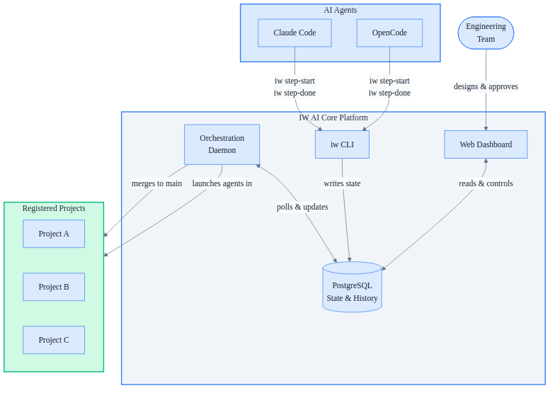

# IW AI Core — Platform Product Overview

IW AI Core is Innovation Ways' orchestration platform for AI-assisted software development — a single, reliable backbone that manages how AI agents plan, execute, review, and ship code changes across any number of projects.

---

## The Problem

Engineering teams adopting AI development tools quickly hit the same wall: the tools work in isolation but fall apart at scale. ID conflicts emerge when multiple agents run in parallel. Execution state scatters across JSON files and markdown directories. There is no unified view across projects. When something goes wrong mid-flight, recovery is manual and fragile.

Building reliable, repeatable AI-assisted workflows on top of ad-hoc file systems is not a tooling problem — it is an infrastructure problem.

---

## What It Is

**IW AI Core** is a standalone platform that serves as the operational backbone for AI-assisted development. It replaces scattered file-based tracking with a database-backed system, giving every registered project atomic ID allocation, crash-safe execution, automated quality enforcement, and real-time visibility — all from a single installation.

The platform is project-agnostic. Any software repository can register itself and immediately benefit from the full workflow pipeline without modifying its codebase.

---

## How It Works

The platform has four components that work together continuously:

- The **Orchestration Daemon** polls the database every 60 seconds, picks up approved work, launches AI agents in isolated workspaces, monitors progress, and merges completed work back to the project's main branch.
- The **`iw` CLI** is the agent-to-platform bridge. AI agents call it to record each step they complete. It enforces all state transitions and writes every update atomically to the database.
- The **Web Dashboard** gives engineering teams real-time visibility into what every agent is doing across all projects, with controls to approve, pause, retry, or inspect any work item.
- **PostgreSQL** is the single source of truth. No state lives in files. No state lives in memory. The daemon can restart at any point and resume exactly where it left off.

---

## Key Capabilities

| Capability | What It Delivers |
|---|---|
| **Multi-project orchestration** | One platform installation manages unlimited registered projects simultaneously |
| **Atomic ID allocation** | Conflict-free, sequential IDs even when dozens of agents run in parallel |
| **Batch execution** | Group multiple work items, analyze dependencies, run independent items in parallel |
| **Automated fix cycles** | When a code review or quality check fails, the platform automatically retries — up to five attempts — before escalating to the team |
| **Crash-safe resumption** | If the daemon crashes mid-execution, agents keep running; the daemon resumes monitoring on restart without losing state |
| **Full audit trail** | Every step start, completion, and failure is recorded with timestamps, making every decision traceable |
| **Skills distribution** | Workflow templates and agent instructions are versioned in the platform and synced to each project automatically |
| **Two-tier archiving** | Completed work items are searchable in the database and their full artifacts are compressed for on-demand retrieval |

---

## Why It Matters

- **Teams ship faster.** AI agents handle the implementation, review, and quality validation loop. Engineers approve and steer — they do not babysit.
- **Nothing gets lost.** Crash-safe design means a failed machine or interrupted session never orphans in-progress work.
- **Visibility replaces anxiety.** The dashboard shows exactly what every agent is doing, what passed, what failed, and why — at any moment.
- **Scale without ceremony.** Adding a new project takes minutes. The platform adapts to the project's existing workflow definition — no rewriting required.
- **Any AI agent works.** The `iw` CLI is the only integration point. Claude Code, OpenCode, or any future tool that can run shell commands is immediately compatible.

---

## Current Status

IW AI Core is production-ready and actively managing the InnoForge project. The database schema, daemon, CLI, dashboard, and executor scripts are all implemented and in daily use. The platform currently supports features, incidents, and change requests as work item types, with a full workflow pipeline covering implementation, code review, quality validation, and merge. Documentation, batch management, and real-time monitoring are live.

---

*Innovation Ways — Building the infrastructure that makes AI-assisted development reliable.*
